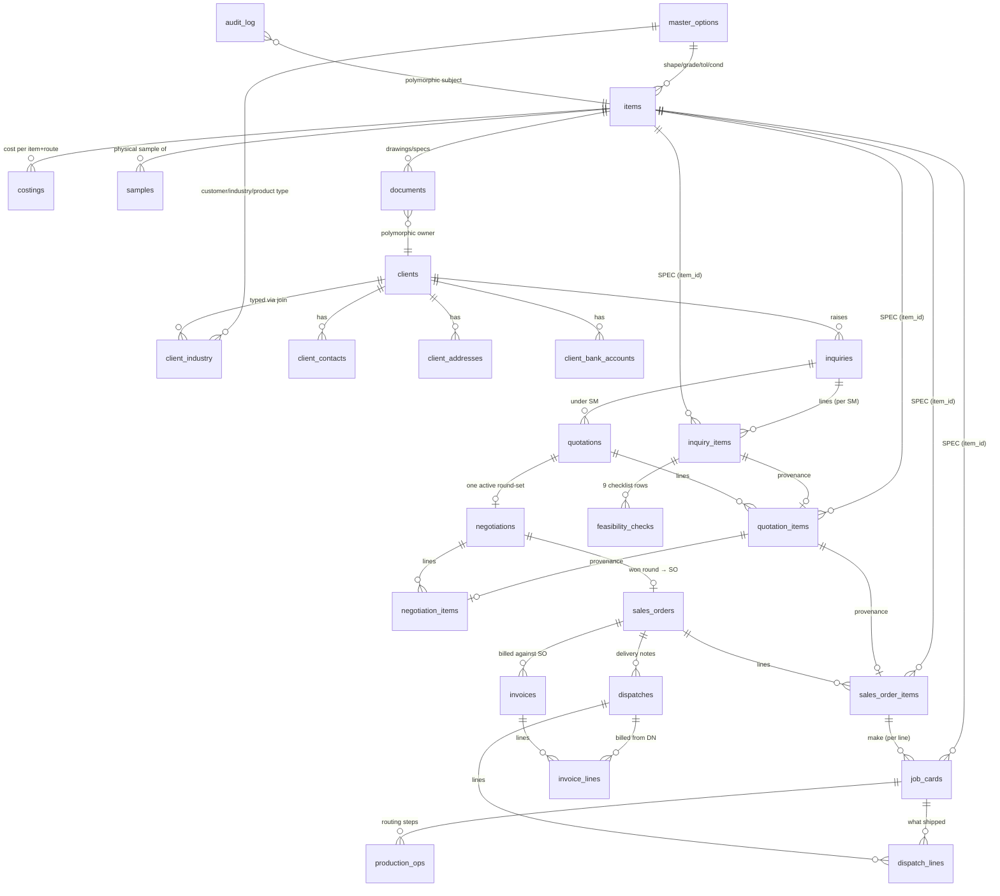
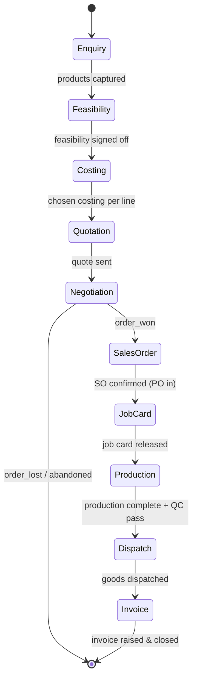

# Carbide India ERP — Architecture Blueprint

**A make-to-order manufacturing ERP for Yogeshwar Engineering Pvt Ltd (Carbide India)**

Version 1.0 · 2026-07-01 · Authoritative design of record

---

## Executive Summary

Carbide India WMS is being redesigned from a scattered set of CRUD screens into a world-class **make-to-order manufacturing ERP** for a tungsten-carbide producer. This is not ecommerce and not inventory management — everything in the system revolves around a single atom: the **product specification**. The sacred business flow is fixed and non-negotiable: **Client → Enquiry (SM number) → Products → Primary Feasibility → Costing → Quotation → Negotiation → Sales Order → Job Card → Production → Dispatch → Invoice.**

The system rests on one supreme rule: **a single source of truth.** One physical product specification equals exactly one `item` row, identified by an immutable dedup fingerprint. Every enquiry line, costing, quote line, negotiation, sales-order line, job card, dispatch, and invoice *references* that item by `item_id` and *reads through* to its spec — it never re-copies it. The audit confirmed that this `item_id` FK spine already exists and is the codebase's strongest asset; this blueprint hardens it, closes the ~21 duplication points around it, and extends it cleanly through the three currently-missing stages (Production, Dispatch, Invoice).

Three structural moves define the redesign. **First**, a guaranteed, transactional item-sync contract replaces today's best-effort loop so no product can ever exist without an item. **Second**, an explicit, guarded state machine replaces free-set status dropdowns, making forward motion the only path and auto-provisioning downstream drafts by reference. **Third**, an enterprise UX shell — persistent nav rail, right-side context drawers with tabs, a lifecycle stepper that *is* the state machine, a federated command palette, and saved views — replaces long vertical forms and modal quick-views. Every screen answers three questions: **Where am I? What is happening? What should I do next?**

The result is a system a team can execute against for 15 years: referentially whole, statutorily compliant for Indian GST, and legible from the shop floor to the boardroom.

---

## North-Star Principles

1. **One Product = One Item.** A single dedup fingerprint yields exactly one `items` row, forever. Two products with identical spec collapse to the same `item_id`. This is enforced twice — a DB unique index and a live create-side dedup check.
2. **Read through, never copy.** Any field describing the product (shape, grade, tolerance, condition, dimensions, HSN, UoM, item code) is resolved by joining `items` at read time. Downstream tables store only FK edges plus genuinely per-transaction facts (qty, this-customer part number).
3. **Snapshot only at legal moments.** The sole legitimate frozen copies are commercial values written at a legal/immutable transition — a *sent* quote's price, a *confirmed* SO's price/spec, an *issued* invoice line, a *released* job-card qty. These live in dedicated snapshot columns paired with a timestamp, are null while the document is a draft, and are written only by the transition action.
4. **Customer data never lives on the reusable item.** An item is shared across many customers; customer part name, ordered qty, and customer grade alias live on the referencing line (`inquiry_items`), never on `items`.
5. **Everything is clickable and linked.** The where-used graph is a first-class primitive. Every SM number, item code, quote number, and client name resolves to its own workspace or drawer.
6. **Forward motion is the only path.** Stage advancement runs through one guarded transition table; you cannot advance a stage until its exit guard is satisfied. Downstream drafts are auto-provisioned by reference.
7. **Referential integrity everywhere.** No unenforced uuid arrays; every cross-module link is a real FK. No stored aggregates — every KPI and rollup is computed live from the FK spine.
8. **Never hard-delete.** Deactivate/archive only, preserving the append-only audit trail. Garbage collection repoints references; it never blind-deletes.
9. **The app is never broken between phases.** Migrations are append-only and sequential; destructive changes ship with archive backups and tested down-migrations; read paths convert to joins *before* any snapshot column is dropped.
10. **The Item is the center of gravity.** Open it from anywhere and see every customer, every price, every job — all resolved through one fingerprint, never a copy.

---

## Canonical Decisions (bind every section)

These freezes resolve the cross-section conflicts surfaced in the chief-architect review and are law for the whole document.

- **Table names are NOT renamed.** Keep `inquiry_items`, `quotation_items`, `negotiation_items`, `sales_order_items`, `costings`. Renames are pure migration risk with zero SSOT benefit and would break the string-matched index/error-retry patterns CLAUDE.md warns about. Prose may use conceptual names (enquiry-product, quote-line) but all schema and queries use the frozen names.
- **`item_status` enum = `draft | active | archived`** (plus `superseded`, reserved only for merge-with-history).
- **Draft-item is canonical.** Every `inquiry_items.item_id` becomes `NOT NULL` and always points at a real item row — a draft (incomplete spec) or an active one. There is no "null until resolved" state.
- **Legal transitions write DB snapshot columns**, not just PDFs. A GST invoice or a sent quote must be reproducible from queryable frozen line data, not a re-parsed PDF. Read-through joins govern live/editable stages; snapshot columns govern sent/confirmed/issued stages.
- **One stage-derivation module** `lib/flow/derive-stage.ts` and **one transition table** `lib/workflow/transitions.ts` are the sole authorities for pipeline state.
- **`origin_*` columns on `items` are write-once, display-only, never queried** for usage, dedup, or search.
- **Merges deactivate the loser (never hard-delete)** and record a full audit row.

---

## Table of Contents

1. Information Architecture, Navigation & Workspace Shell
   - 1.1 Top-level module map
   - 1.2 Register vs Workspace — the core distinction
   - 1.3 The app shell (chrome)
   - 1.4 Command palette (⌘K) — jump + act
   - 1.5 Global instant search vs command palette
   - 1.6 Saved views & pinned filters
   - 1.7 Where-am-I / What's-happening / What-next per surface
   - 1.8 The stepper as state-machine projection
   - 1.9 Route/segment mapping
2. Data Architecture & Single-Source-of-Truth ERD
   - 2.1 The canonical entity graph
   - 2.2 Core entity definitions
   - 2.3 New entities: the MES/finance tail
   - 2.4 The snapshot rule
   - 2.5 Duplication points: remove vs keep
   - 2.6 The where-used graph
   - 2.7 Migration deltas
   - 2.8 Backbone invariants
3. Guaranteed Item-Sync Contract (product → Item, synchronous)
   - 3.1 The three invariants
   - 3.2 Schema deltas
   - 3.3 The fingerprint, extended for drafts
   - 3.4 The single contract function
   - 3.5 Wiring into enquiry create/edit
   - 3.6 Completing a draft → active
   - 3.7 Repoint & draft GC
   - 3.8 Backfilling the legacy gap
   - 3.9 Draft visibility (UX)
   - 3.10 The sync state machine
4. End-to-End Workflow State Machine & Stage Gates
   - 4.1 The ten-stage machine
   - 4.2 Stage-by-stage specification
   - 4.3 Reads-from-previous resolution pattern
   - 4.4 The Item Gate
   - 4.5 The per-SM progress stepper
   - 4.6 Guard & transition enforcement
5. Roles, Permissions & Governance
6. Item Master — Product Intelligence Database
   - 6.1 First principle: reusable spec, not customer line
   - 6.2 Two entry surfaces, one data contract
   - 6.3 The ItemIntelligence field set
   - 6.4 The Item Workspace
   - 6.5 The Item Context Drawer (10 tabs)
   - 6.6 Tab responsibilities matrix
   - 6.7 State & edit rules
   - 6.8 Schema deltas
   - 6.9 Query & mutation shapes
7. Product Picker — SAP-style Material Search
   - 7.1 Usage surfaces
   - 7.2 Search index & query shape
   - 7.3 Result row anatomy
   - 7.4 Inline "Create New Item"
   - 7.5 State machine
   - 7.6 Component & data contract
8. Client Workspace (per-client dashboard)
   - 8.1 Route & data-loading shell
   - 8.2 KPI header — live from the SSOT
   - 8.3 Overview, work surfaces, financials, documents, timeline
   - 8.4 State rules & invariants
9. Enquiry SM Workspace (the pipeline cockpit)
   - 9.1 Route & shell structure
   - 9.2 Header — the "where am I" bar
   - 9.3 Tab structure
   - 9.4 Query & mutation shapes
   - 9.5 Product drawer & stepper derivation
10. Job Card Workspace (production work order)
    - 10.1 Where the Job Card sits
    - 10.2 Data model changes
    - 10.3 The split workspace
    - 10.4 Live-resolved right pane
    - 10.5 Create flow & lifecycle
11. Production, Dispatch & Invoice/GST (the make-to-order tail)
    - 11.1 Production & lot traceability
    - 11.2 Dispatch & delivery notes
    - 11.3 Invoicing & GST compliance
12. Design System, Interaction Patterns & Density
    - 12.1 Reuse-vs-build map
    - 12.2 Tokens, typography, density
    - 12.3 The eleven primitives
    - 12.4 Killing long vertical forms
    - 12.5 Keyboard model
13. Performance, Print & Offline Posture
14. Implementation Plan (Phased)
15. Definition of Done for v1

---

## 1. Information Architecture, Navigation & Workspace Shell

> **North star:** every pixel exists to answer three questions on every screen — **Where am I?** (context bar + breadcrumb + stepper), **What's happening?** (status, stage, KPIs, live counts), **What next?** (primary next-step CTA driven by the state machine). The IA is organized around the *Item as single source of truth* and the *SM number as the sales repo*; navigation always resolves back to those two spines.

### 1.1 Top-level module map

The ERP is grouped into **5 domains**, each owning a set of *Registers* (lists) and *Workspaces* (single-record hubs). This keeps the existing `app/(app)`/`app/(admin)` route-group split but re-parents routes under domain segments so the URL communicates the IA.

```
CARBIDE INDIA ERP
│
├── SALES  (the sacred flow lives here)
│    ├── Enquiries / SM Repo ........ register  /sales/enquiries          → workspace /sales/enquiries/[sm]
│    ├── Costings .................... register  /sales/costings
│    ├── Quotations ................. register  /sales/quotations
│    ├── Negotiations ............... register  /sales/negotiations
│    ├── Sales Orders .............. register  /sales/orders              → workspace /sales/orders/[id]
│    ├── Samples .................... register  /sales/samples
│    └── Clients .................... register  /sales/clients            → workspace /sales/clients/[id]
│
├── PRODUCT  (the SSOT spine)
│    ├── Item Master ............... register  /product/items            → workspace /product/items/[id]  ★hub
│    ├── Where-Used Explorer ....... tool      /product/items/[id]#where-used
│    └── Item Intelligence ......... analytics /product/insights
│
├── PRODUCTION  (make-to-order execution)
│    ├── Job Cards .................. register  /production/job-cards      → workspace /production/job-cards/[id]
│    ├── Production Orders ......... register  /production/orders
│    ├── Dispatch / Delivery ....... register  /production/dispatch
│    └── Invoicing ................. register  /production/invoices
│
├── MASTERS  (governed reference data)
│    ├── Customer / Industry Types . register  /masters/customer-types …
│    ├── Product Types ............. register  /masters/product-types
│    ├── Grades / Tolerance / Cond . register  /masters/grades …
│    └── Shapes (+ dim config) ..... register  /masters/shapes
│
└── ADMIN  (governance & platform)
     ├── Employees / Departments / Roles
     ├── Notifications / Digest
     ├── Activity / Audit Log
     └── Org Settings / Statuses
```

**Why this grouping (grounded in the audit):**
- **Sales** collects every stage that shares the `inquiryId` cascade and the SM number, plus Clients (the party the SM belongs to). Grouping under `/sales` makes the pipeline legible.
- **Product** is elevated to its own domain because `items` + the `item_id` FK chain is *the* single-source spine. It is reused across many SMs/customers, so it must not live under Sales.
- **Production** houses the make-to-order execution tail; Production/Dispatch/Invoice get first-class slots now so nav needn't be re-cut later.
- **Masters** consolidates the governed, deactivate-only `master_options`.
- **Admin** is platform/governance, role-gated.

### 1.2 Register vs Workspace — the core distinction

Every route is one or the other. This is the single most important IA rule.

| | **REGISTER** (list) | **WORKSPACE** (single-record hub) |
|---|---|---|
| **Answers** | "Which records match my lens?" | "Everything about *this one* record + what to do next" |
| **Route shape** | `/sales/enquiries` | `/sales/enquiries/[sm]` |
| **Primitive** | `RegisterDataTable` (extend: saved views + server paging) | `WorkspaceShell` = header + stepper + tabbed body + sticky rail + right drawer |
| **Selection** | row → **peek** (right drawer) or **open** (full workspace) | tabs / linked-record navigation |
| **Used for** | Enquiries, Costings, Quotations, Negotiations, Orders, Samples, Clients-list, Items-list, Job-cards-list, all Masters | SM/enquiry, Item, Client, Sales Order, Job Card |

A *Register* is a set operation (filter/sort/select-many); a *Workspace* is a record operation. **Which records get a full Workspace:** SM/Enquiry, Item, Client, Sales Order, Job Card. Costings/Quotations/Negotiations/Samples are *stages of the SM* — they render as tabs inside the SM workspace, and their registers are cross-SM operational lists (e.g. "all quotations awaiting send"). This resolves the "stages created independently" gap: the SM workspace is the forward-wiring hub; the stage registers are for triage across many SMs.

### 1.3 The app shell (chrome)

A persistent **three-zone shell**: left rail (domain nav) · center content · right context drawer. Desktop-first; the `--max-content` cap lifts to fluid for registers/workspaces (the reading-width cap applies only to detail bodies).

```
┌───────────────────────────────────────────────────────────────────────────────────────────┐
│ ┌───────┐  Carbide India      [  ⌘K  Search SM / Item / Client / Order… ]        ◔ ⚑3  ⧉  ●│ ← GLOBAL BAR
├────────────┬────────────────────────────────────────────────────────────────┬───────────────┤
│  NAV RAIL  │  CONTEXT BAR (breadcrumb + where-am-I + stage stepper)          │  CONTEXT      │
│ ● Sales  4 │  Sales › Enquiries › SM1042  ·  Acme Tools  ·  4 products        │  DRAWER       │
│ ○ Product  │  ◉──◉──◉──○──○──○   Enquiry·Feas·Costing·[Quote]·Neg·SO          │  (slides in)  │
│ ○ Produc.  │ ┌────────────────────────────────────────────────────────────┐ │               │
│ ○ Masters  │ │  TABS: Overview | Products | Costing | Quote | Neg | SO |   │ │  Peek / Where │
│ ○ Admin    │ │        Samples | Docs | Activity                           │ │  -used /      │
│ ─────────  │ ├────────────────────────────────────────────────────────────┤ │  Docs / Hist  │
│ SAVED VIEWS│ │   ACTIVE TAB BODY (high-density, multi-column)  ┌────────┐  │ │  as tabs      │
│ ★ My open  │ │                                                 │ STICKY │  │ │               │
│ ★ Await me │ │                                                 │SUMMARY │  │ │               │
│ ★ Hot ord. │ │                                                 │+ NEXT  │  │ │               │
│ + New view │ │                                                 │  STEP  │  │ │  [Esc] closes │
└────────────┴────────────────────────────────────────────────────────────────┴───────────────┘
```

**Zone responsibilities:** (1) Global bar — logo, command-palette trigger, global search, notifications, density toggle, user menu; (2) Nav rail — the 5 domains with live count badges plus a Saved Views section; (3) Context bar — breadcrumb + stage stepper derived from the state machine (not a free dropdown); (4) Content — active Register or Workspace; (5) Sticky summary + Next-step rail — always shows the state-machine's next legal action; (6) Right context drawer — the new `Sheet` primitive, slides from right, tabbed, used for register peek and where-used everywhere.

### 1.4 Command palette (⌘K) — jump + act

Three sections cover every core entity.

```
┌─────────────────────────────────────────────────────────┐
│ ⌘K   type to search or run a command…                    │
├─────────────────────────────────────────────────────────┤
│ JUMP TO   🔎 SM1042 · Acme Tools · 4 products   Enquiry  │
│           🔎 IT-10231 · Cyl OD12×L40 · K20      Item     │
│           🔎 CL-0087 · Acme Tools Pvt Ltd       Client   │
├─────────────────────────────────────────────────────────┤
│ ACTIONS   ＋ New Enquiry                      g then e    │
│           ＋ Generate Item from product…                  │
│           ↦ Advance SM1042 → Send Quote      (context)   │
├─────────────────────────────────────────────────────────┤
│ GO TO     → Quotations awaiting send                     │
│           → My open enquiries (saved view)               │
└─────────────────────────────────────────────────────────┘
```

- **Jump-to** federates across `inquiries.smNumber`, `items.itemCode`/dedup spec, `clients.name/clientCode`, `sales_orders.soNo`, `quotations.quoteNo` in one query (`lib/queries/command-search.ts`, `UNION ALL` of typed rows, `LIMIT` per type, trigram/`ILIKE` on indexed codes). Each result navigates to that workspace (or opens its context drawer when a host is present; ⌘-Enter forces full nav).
- **Actions** = server-action launchers + **context actions** injected from the current record's state machine (e.g. "Advance → Send Quote").
- **Go to** = saved views + common registers.
- Keyboard: `g e` enquiries, `g i` items, `g c` clients, `g o` orders (extends existing `g`-nav).

### 1.5 Global instant search vs command palette

Two surfaces, one backend. The **⌘K palette** is keyboard-first, federated, includes actions. The **search box** in the global bar is mouse-first, hits the same `command-search` query, and shows results as a dropdown with entity tabs (All · SM · Items · Clients · Orders). Both debounce (TanStack Query) and hit the same indexed columns — no client-side scanning of large sets.

### 1.6 Saved views & pinned filters

Register lenses become first-class. **URL-as-state** (nuqs) is the source of truth: `?view=&q=&status=&client=&sort=&cols=`. A saved view persists that querystring under a name in a `saved_views` table (`id, ownerId FK, entity, name, config jsonb, isShared, sortOrder`) — per-user; admins can mark a view org-shared. Pinned views surface in the nav rail and the palette's "Go to" section. Seed system views per register: **My open**, **Awaiting me**, **Overdue**, **Hot / won this month**.

### 1.7 Where-am-I / What's-happening / What-next per surface

| Surface | Where am I | What's happening | What next |
|---|---|---|---|
| **Register** | nav pill + breadcrumb + saved-view name + count | filter chips, count badges, status chips | bulk bar; row → peek drawer → "Open workspace" |
| **SM Workspace** | breadcrumb + **stage stepper** | current stage highlighted; per-product status; KPIs | sticky **Next-step CTA** from state machine |
| **Item Workspace** | breadcrumb + item code + spec line | governance badge; **where-used count** | tabs incl. Where-used; CTA "Add to enquiry" |
| **Client Workspace** | breadcrumb + client code | open enquiries/orders KPIs | CTA "New Enquiry for client" |
| **SO / Job Card** | breadcrumb + doc no + stepper | production stage, dispatch condition | next legal transition CTA |

### 1.8 The stepper as state-machine projection

The context-bar stepper renders the sacred flow and is the UI of the guarded state machine. Each node is a stage with a derived status. Node state is computed server-side (§4.6, `lib/flow/derive-stage.ts`) from the real FK spine + status enums, not free-set dropdowns. Clicking a node deep-links to that tab/record. Disabled/locked nodes show *why* on hover (e.g. "Costing required before Quotation") — enforcing transitions instead of free-setting.

### 1.9 Route/segment mapping

```
app/(app)/
  sales/enquiries/  page.tsx (register)  [sm]/page.tsx (WorkspaceShell + tabs)  new/  import/
  sales/costings/ quotations/ negotiations/ orders/[id]/ samples/ clients/[id]/
  product/items/    page.tsx (register)  [id]/page.tsx (Item WorkspaceShell)   insights/
  production/job-cards/[id]/  orders/  dispatch/  invoices/
  masters/          <kind>/page.tsx
  search/           page.tsx (results register)
app/(admin)/admin/  employees/ departments/ roles/ notifications/ activity/ settings/ statuses/
```

**Shared primitives to build/promote:** `components/shell/WorkspaceShell.tsx`, `ContextBar.tsx`, `Stepper.tsx`, `NavRail.tsx`, `components/ui/Sheet.tsx` (right drawer — consolidates today's 3 modal implementations), the extended `RegisterDataTable`, `lib/queries/command-search.ts`, `lib/flow/derive-stage.ts`, `lib/queries/nav-counts.ts` (exists). The duplicated `ReadCard`+`InfoGrid` detail scaffolding is retired into `DetailGrid` inside workspace tab bodies.

---

## 2. Data Architecture & Single-Source-of-Truth ERD

This section defines the **target** ERD. The design goal is singular: **one Product = one `item` row**, and every downstream document *references* it and *reads through* to its spec. The only legitimate copies are commercial snapshots frozen at legal moments (§2.4). The audit-confirmed `item_id` spine is kept, hardened, and stripped of its ~21 duplication points.

### 2.1 The canonical entity graph



**Two axes:** (1) the **SPEC axis** — `items` is the product specification (shape, grade, tolerance, condition, dimensions, HSN, UoM) with *no customer, qty, price, or SM number*; every line points at it via `item_id`. (2) the **COMMERCIAL/FLOW axis** — `inquiries → quotations → negotiations → sales_orders → dispatches → invoices`, each with a `*_items` child carrying transactional facts (qty, this-customer price/part number) plus an `item_id` pointer.

The invariant: **spec lives once, on `items`. Transaction facts live on the line. Nothing else.**

### 2.2 Core entity definitions

**Bold** = new/changed; ~~strike~~ = drop.

#### `items` — the canonical product spec (SSOT)
```
id (uuid pk)
seq                int         -- single item_seq_seq draw
item_code          text unique -- assembled from seq + master short codes (app sole-writer; CHECK/trigger asserts seq↔code)
dedup_key          text unique -- fingerprint (9-field)
status             item_status -- draft | active | archived (+ superseded reserved)  ** NEW
draft_reason       text        -- e.g. "missing:outerDia,length"                     ** NEW
completed_at       timestamptz                                                        ** NEW
-- CLASSIFICATION (FK → master_options): shape_id, internal_grade_id, tolerance_id, condition_id
-- DIMENSIONS: outer_dia, inner_dia, length, width, thickness (numeric), size_code
-- IDENTITY/CATALOG: part_no, part_desc, hsn_code, uom, costing_type
-- PRODUCTION KNOWLEDGE (reusable): production_notes text, pressing_type_id FK          ** NEW
-- INTERNAL NAMING: product_name (canonical internal name), weight_grams (cached)       ** NEW
-- PROVENANCE (origin only, write-once, display-only, NEVER queried):
   origin_inquiry_id, origin_sm_number, origin_customer_name, origin_enquiry_date, origin_cust_product_name, origin_qty
-- GOVERNANCE: is_active, deleted_at, created_at, updated_at, created_by_id
```
**Dropped/relabelled:** the former `sm_number`, `customer_name`, `cust_product_name`, `qty`, `enquiry_date` become `origin_*` (renamed so misuse is self-evident); `cust_drawing_no`, `drawing_revision_no`, `grade_customer`, `grade_name_for_cust` move to `inquiry_items`. Rule: *if you can't answer "which customer?" from an `items` row alone, no customer-scoped column belongs there.*

#### `inquiry_items` — the customer's ask, per SM line
```
id, inquiry_id FK→inquiries (cascade), sort_order
item_id            uuid FK → items (RESTRICT), NOT NULL  ** always points at draft or active item
-- CUSTOMER-SCOPED ASK (moved off items): cust_product_name, cust_drawing_no, drawing_revision_no, qty, grade_customer
-- RAW ENTRY (pre-item buffer / audit of what was typed): shape text, dims, grade_id, tolerance_id, condition_id
-- feasibility rollup (detail in feasibility_checks): feasibility_status enum
```
Once `item_id` resolves, spec fields display **read-through from `items`**; raw-entry fields remain only as the pre-resolution buffer.

#### `costings` — cost per item + route
```
id
item_id            uuid FK → items (RESTRICT), NOT NULL (after backfill)   ** NEW: cost is per ITEM, reusable
inquiry_item_id    uuid FK → inquiry_items (set null)  -- provenance: who triggered this costing
costing_route      enum(inhouse|bought_out), costing_logic enum, is_chosen bool
... all cost inputs + computed outputs ...
unique (item_id, costing_route, revision)
```
Costing keys to `item_id`, giving **cost history per Item** and letting a re-enquiry of the same spec reuse/branch the costing.

#### Commercial line tables — `quotation_items`, `negotiation_items`, `sales_order_items`
All share one shape (exemplar: `quotation_items`):
```
id, quotation_id FK (cascade), sort_order
item_id            uuid FK → items (RESTRICT)   -- SSOT
inquiry_item_id    uuid FK → inquiry_items (set null)   -- provenance chain
-- downstream: quotation_item_id, negotiation_item_id (provenance)
qty                numeric      -- transactional
cust_part_no       text         -- this customer's PO part number (legit per-txn)
-- COMMERCIAL SNAPSHOT (frozen only when doc is SENT/CONFIRMED — §2.4):
unit_price         numeric      -- null until sent
spec_snapshot      jsonb        -- null until sent; frozen spec for legal PDF reproduction
frozen_at, frozen_by
```
**Dropped from every line/header table:** always-copied `cust_product_name`, `drawing`, free-text `grade`/`tolerance`/`condition`, `part_no`, `final_cost`, and all header snapshots (`company_name`, `qty`, prices…). These are read-through from `items` + `costings.is_chosen`. Headers keep only doc no, dates, `client_id` FK, `inquiry_id` FK, status, computed totals, sent/accepted timestamps, and (SO) `negotiation_id`.

#### `job_cards` — production work order
```
id, job_card_no unique, oa_no
sales_order_item_id uuid FK → sales_order_items (set null)   ** NEW: per-line traceability
sales_order_id      uuid FK → sales_orders (set null)   -- convenience
inquiry_item_id     uuid FK → inquiry_items (set null)   -- lineage
item_id             uuid FK → items (set null)          -- convenience; canonical via so_line→item
client_id           uuid FK → clients (set null)
dispatch_condition_id, tolerance_id, pressing_type_id FK→master_options
qty_ordered        numeric   -- the ONE legit JC snapshot, written at release/issue (§2.4)
status             job_card_status   -- ** NEW lifecycle (§10)
... production process free-text fields (dia_size, punch_size, weight...) ...
is_active, deleted_at, created_at
```
**Dropped:** `customer_name`, `product_code`, `product_name`, `grade_name`, `grade_colour` — all read-through via `item_id`/`client_id`. `product_code` in particular must never diverge from `items.item_code`.

### 2.3 New entities: the MES/finance tail

- **`production_ops`** (name frozen) — routing steps under a job card: `job_card_id` (cascade), `sort_order`, `op_code` (pressing/sintering/grinding/EDM/QC), `work_center_id`, `status` (pending|in_progress|done|scrapped|rework), `qty_in/out/scrap`, `started_at/completed_at`, `operator_id`. `work_centers` is a light master (id, name, code, is_active).
- **`rm_lots`** + **`production_consumption`** — heat/batch lot tracking (carbide sintering is lot-critical for traceability and recalls) and lot→op RM consumption. Scrap/yield capture flows a **feedback edge to `costings`** (actuals vs estimate).
- **`production_qc`** — per-lot QC records.
- **`dispatches`** + **`dispatch_lines`** — delivery notes: `dispatch_no`, `sales_order_id`, `client_id`, dispatch_date, mode, lr_no, vehicle_no, `ship_to_address_id`, status, e-way-bill fields (phase-2 optional). Lines: `so_line_id`, `job_card_id`, `item_id`, `qty_dispatched`.
- **`invoices`** + **`invoice_lines`** + **`credit_notes`** + **`payments`** — statutory finance (§11.3).

### 2.4 The snapshot rule

> **READ-THROUGH BY DEFAULT.** Any field describing the product is resolved by joining `items` (and `inquiry_items` for customer-ask fields). It is never stored on quote/neg/SO/job-card/dispatch rows.

> **SNAPSHOT ONLY AT A LEGAL/IMMUTABLE MOMENT.** A frozen copy is created exactly when a document becomes a legal artifact the counterparty relies on.

| Snapshot | Written when | Table.column | Why read-through fails |
|---|---|---|---|
| Quote price | quote → `sent` | `quotation_items.unit_price`, `.spec_snapshot`, `.frozen_at` | Re-costing later must not change an already-sent quote |
| Negotiated price | round → `verbal_yes`/agreed | `negotiation_items.unit_price` | The agreed number is a fact of that round |
| SO price/spec | SO → `confirmed` | `sales_order_items.unit_price`, `.spec_snapshot` | The order is a contract; fixed at confirmation |
| JC qty | job card → `released` | `job_cards.qty_ordered` | Shop floor works to the qty as issued |
| Invoice line | invoice → `issued` | `invoice_lines.*` + header totals | Statutory; must reproduce exactly forever, GST-locked |

**Rule of thumb:** *price and legally-printed spec* snapshot at the send/confirm/issue transition; everything else reads through. A snapshot column is always paired with a `frozen_at` timestamp and is **null while the document is a draft** (drafts read through live, so editing the item still updates a draft quote). `spec_snapshot` is `jsonb` so a re-classified item never alters a historical PDF.

**Enforcement:** the snapshot is written **only** inside the status-transition server action (`onQuotationSent`, `onSalesOrderConfirmed`, `onInvoiceIssued`), never on create/update of the line — so `updateItem` can only ever affect *draft* documents. This law reconciles the two axes: **the frozen legal artifact is both the rendered PDF (a `documents` row) and the DB snapshot columns.** You cannot re-serve a GST invoice from a re-parsed PDF, and litigation needs queryable frozen line data — so the queryable DB snapshot is authoritative for value; the PDF is the human-facing rendering.

### 2.5 Duplication points: remove vs keep

**REMOVE (repoint to read-through):**

| Point | Action |
|---|---|
| `inquiries` single-product block (productDescription, shape, dims, grade…) | DROP — the SM is many-product; lines live in `inquiry_items` only |
| `inquiries` client snapshot (companyName, address, contact*) | DROP — read-through `client_id`; keep for archived SMs via view |
| `items` customer/SM snapshot cols | RELABEL to `origin_*` (write-once, display-only); move customer-ask to `inquiry_items` |
| header snapshots on quotations/negotiations/sales_orders | DROP — read-through + computed totals |
| line spec/price copies + free-text tolerance/condition | DROP — read-through `items`/`costings`; convert text→id |
| `job_cards` customer/product/grade snapshots | DROP — read-through `item_id`/`client_id` |
| `costings` inquiry_item-only, no item link | ADD `costings.item_id NOT NULL`; costing per item |
| `clients.customerTypeId`/`industryTypeId` scalar mirror of arrays | DROP scalars |
| `clients.customerTypeIds[]/industryTypeIds[]/productTypeIds[]` unenforced arrays | REPLACE with join `client_industry (client_id, master_option_id, kind)` — real FKs, where-used enabled |
| `clients` legacy flat address + 5 bank cols + billTo/shipTo text | DROP — normalized child tables authoritative |

**KEEP (legitimate):** the entire `item_id` FK spine; provenance chain columns (`inquiry_item_id`, `quotation_item_id`, `negotiation_item_id`, `sales_order_item_id`); the `dedup_key` unique index; commercial snapshots per §2.4; JC `qty_ordered` at release; `documents` polymorphic FKs (extended, not removed); `audit_log` polymorphic (audit rows are *supposed* to freeze names at action time).

**Item-code invariant:** `item_code` **cannot** be a pure SQL generated column because assembly joins master short codes. Keep the app sole-writer invariant and add a CHECK/trigger asserting `seq` ↔ `item_code` consistency at insert.

### 2.6 The where-used graph

Two complementary graphs, both anchored on `items.id`:

**(A) Spec fan-out — "everywhere this exact spec is used"** (direct `item_id` edges): `inquiry_items`, `quotation_items`, `negotiation_items`, `sales_order_items`, `job_cards`, `costings`, `samples`, `dispatch_lines`, `invoice_lines`, `documents`.

**(B) Provenance chain — "this one product's flow"** (walk the provenance FKs): `inquiry_item → quotation_item → negotiation_item / sales_order_item → job_card → dispatch_line → invoice_line`.

**Query shape** (RSC, `lib/queries/item-where-used.ts`) — one `UNION ALL` fan-out (not 9 round trips), joined to live `items` + `clients`, indexed. **Required indexes** (audit-flagged missing): `quotation_items(item_id)`, `negotiation_items(item_id)`, `sales_order_items(item_id)`, `dispatch_lines(item_id)`, `invoice_lines(item_id)`, `samples(item_id)`. Existing kept: `items_dedup_key_uidx`, `costings_item_idx`, `job_cards_item_idx`, `documents_item_idx`. Register "used in N" counts are precomputed per-page via a single grouped query (cacheTag-invalidated on line writes), never per-row N+1. Budget: where-used **< 150ms** (§13).

This graph powers the Item drawer's Where-Used tab and the reverse "linked records" panel on every enquiry/quote/SO — which resolve their spec *from* the item, proving read-through in the UI itself.

### 2.7 Migration deltas

Applied as new sequential migrations; `drizzle-kit generate` must return "no changes" after each. See §14 for the full phased ordering; the schema deltas are:

- **Additive tail:** `work_centers, production_ops, rm_lots, production_consumption, production_qc, dispatches, dispatch_lines, invoices, invoice_lines, credit_notes, payments, client_industry`.
- **Costing repoint:** add `costings.item_id` (nullable → backfill → NOT NULL); `unique(item_id, costing_route, revision)`.
- **New FKs & provenance:** `job_cards.sales_order_item_id` + `inquiry_item_id`; `sales_orders.negotiation_id` (fixes the negotiation→SO break); commercial-snapshot columns on line tables; where-used indexes; `samples.item_id` + `inquiry_item_id`; extend `documents` with inquiry/quotation/negotiation/sales_order/dispatch/invoice FKs.
- **Client normalization:** create `client_industry`, backfill, drop arrays + scalars + legacy flat address/bank/billTo/shipTo.
- **De-snapshot:** drop the ~14 always-copied mirror columns, **guarded by a block-on-drift precheck** (§14 Phase 6) — the migration hard-fails if any live/editable row's snapshot ≠ read-through; a `_snapshot_archive` table backs up dropped columns for reversibility. Sent/confirmed rows are exempt (their snapshot migrates into the legal `unit_price`/`spec_snapshot` shape).
- **Invariants:** CHECK/trigger for `seq`↔`item_code`; `inquiry_items.item_id SET NOT NULL` + `ON DELETE RESTRICT` after total backfill.

### 2.8 Backbone invariants (enforced, not by convention)

1. **Spec is single-sourced** — no product-describing column exists on any line/header table post-migration; display = join to `items`.
2. **Customer-scoped data never on `items`** — enforced by column absence; lives on `inquiry_items`.
3. **Costing is per-item** — `costings.item_id NOT NULL` after backfill.
4. **Snapshots only at legal transitions** — written solely by transition actions; null in draft.
5. **`item_code` matches `seq`** — CHECK/trigger, app sole-writer.
6. **Referential integrity everywhere** — `client_industry` replaces unenforced arrays; every cross-module link is a real FK.
7. **Per-line traceability end-to-end** — `inquiry_item → quotation_item → sales_order_item → job_card → dispatch_line → invoice_line`, unbroken, plus direct `item_id` on each for spec fan-out.

---

## 3. Guaranteed Item-Sync Contract (product → Item, synchronous)

> **Contract in one sentence:** the moment a product line is committed inside an Enquiry, it **already carries an `item_id`** — a reused existing Item or a freshly-minted one (possibly `draft`) — written **in the same database transaction** as the `inquiry_items` row, so there is never a window in which a product exists without an Item, and never a product silently dropped from the Item Master.

This replaces today's after-commit, best-effort try/catch loop (`inquiries/actions.ts:186-197`) — the single biggest SSOT hole — with a **transactional, total, idempotent** sync that produces a visible record for *every* product, including incomplete ones.

### 3.1 The three invariants

| # | Invariant | Enforcement |
|---|---|---|
| **I1 — Totality** | Every `inquiry_items` row has a non-null `item_id` after commit. No exceptions. | DB `NOT NULL` on `inquiry_items.item_id` (after backfill) + `syncProductToItem()` runs *inside* the same tx. |
| **I2 — Single fingerprint** | One fingerprint ⇒ exactly one Item, forever. | `items_dedup_key_uidx` UNIQUE + `onConflictDoNothing` + re-select (kept). |
| **I3 — Nothing hidden** | An incomplete spec still produces a **visible, searchable** Item in `status='draft'`. | `items.status` enum; draft dedup key uses a stable synthetic salt so re-adds reuse the same draft. |

### 3.2 Schema deltas

```ts
// db/enums.ts
export const itemStatusEnum = pgEnum("item_status", ["draft", "active", "archived"]); // + "superseded" reserved

// db/schema.ts — items
status:      itemStatusEnum("status").notNull().default("active"),
draftReason: text("draft_reason"),          // e.g. "missing:outerDia,length" | "missing:shape"
completedAt: timestamp("completed_at", { withTimezone: true }),

// inquiry_items — tighten the SSOT link (enforced AFTER backfill)
itemId: uuid("item_id").references(() => items.id, { onDelete: "restrict" }).notNull(),
```
Plus the where-used indexes (§2.6) and `items_status_idx` for fast draft filtering.

**Why `draft` in the same table (not a side table):** a draft Item gets a *real* `item_id`, shows in `/items` (filtered), and is dedup-keyed — so the instant its missing dims are filled it is **promoted in place** to `active` with the **same id**, and every referencing row needs *zero* re-wiring. A side table would reintroduce the disconnected-record problem the contract exists to kill.

### 3.3 The fingerprint, extended for drafts

The existing `itemDedupKey()` is kept verbatim for **complete** specs. Incomplete specs get a **provenance-salted** key so two different incomplete products don't collapse:

```ts
export function draftDedupKey(inquiryItemId: string) { return `draft:${inquiryItemId}`; }

export function itemDedupKeyFor(spec: ItemSpec, inquiryItemId: string) {
  const missing = missingRequiredDims(spec);      // [] when complete
  return missing.length === 0
    ? { key: itemDedupKey(spec), status: "active" as const, missing }
    : { key: draftDedupKey(inquiryItemId), status: "draft" as const, missing };
}
```
`missingRequiredDims` reuses `resolveShapeConfig` + `requiredDims`. Shape missing entirely ⇒ `missing=["shape"]` ⇒ draft (closing the failure-mode where a shapeless product created a degenerate active item or was silently skipped).

### 3.4 The single contract function

One transaction-aware function is the **only** writer, superseding both `createItem` and the inline mapping in `generateItemForInquiryItem`.

```ts
// lib/item-master/sync.ts
export async function syncProductToItem(tx: DrizzleTx, spec: ItemSpec, inquiryItemId: string): Promise<SyncResult> {
  // 1. classify (never rejects incomplete)
  const { key, status, missing } = itemDedupKeyFor(spec, inquiryItemId);
  // 2. dedup with row-lock to serialize concurrent adds
  const existing = await tx.select().from(items).where(eq(items.dedupKey, key)).for("update").limit(1);
  if (existing[0]) return { itemId: existing[0].id, itemCode: existing[0].itemCode, status: existing[0].status, reused: true, missing };
  // 3. create (single serial draw — seq & code never diverge)
  const [{ nextval: seq }] = await tx.execute(sql`select nextval('item_seq_seq')`);
  const itemCode = status === "draft" ? `DRAFT-${seq}` : buildItemCode(seq, await resolvedShortCodes(tx, spec));
  const [row] = await tx.insert(items).values({
    seq, itemCode, dedupKey: key, status,
    draftReason: missing.length ? `missing:${missing.join(",")}` : null,
    completedAt: status === "active" ? new Date() : null,
    ...specColumns(spec),                // shape/grade/dims/hsn/uom ONLY (no customerName/qty)
  }).onConflictDoNothing({ target: items.dedupKey }).returning();
  // 4. race loser re-select (I2 under concurrency)
  if (!row) { const [won] = await tx.select().from(items).where(eq(items.dedupKey, key)).limit(1);
    return { itemId: won.id, itemCode: won.itemCode, status: won.status, reused: true, missing }; }
  return { itemId: row.id, itemCode: row.itemCode, status, reused: false, missing };
}
```
Key differences from today's `createItem`: **takes `tx`** (participates in the enquiry transaction); **never errors on missing dims** (returns a draft); **`.for("update")` row-lock** hardens the dedup race; **writes no customer snapshot columns** to `items`.

### 3.5 Wiring into enquiry create/edit

```ts
// createInquiry — rewritten boundary
await db.transaction(async (tx) => {
  const [inq] = await tx.insert(inquiries).values(hdr).returning();
  for (const p of productRows) {
    const [line] = await tx.insert(inquiryItems).values({ inquiryId: inq.id, ...productColumns(p) }).returning({ id: inquiryItems.id });
    const res = await syncProductToItem(tx, toSpec(p), line.id);        // SAME-TX sync — the contract
    await tx.update(inquiryItems).set({ itemId: res.itemId }).where(eq(inquiryItems.id, line.id));  // I1
  }
});   // commit: enquiry + all lines + all items atomic
```
**Consequences (deliberate):** if item-gen fails for a *real DB reason*, the enquiry rolls back too (we never want a committed product with no Item). Incomplete specs do **not** cause rollback — they produce drafts. `generateItemForInquiryItem` becomes a thin wrapper that only ever promotes/reuses.

**Enquiry EDIT** re-runs the contract inside the update tx: `updateInquiry` now edits `inquiry_items` and re-syncs each changed line (closing the "edit never re-syncs" failure). Fingerprint drift re-links to the correct Item, with an audit row on relink.

### 3.6 Completing a draft → active (promote-in-place)

```ts
export async function completeItem(tx, draftItemId, filledSpec) {
  const missing = missingRequiredDims(filledSpec);
  if (missing.length) return { ok: false, missing };                    // stay draft
  const realKey = itemDedupKey(filledSpec);
  const [twin] = await tx.select().from(items).where(and(eq(items.dedupKey, realKey), eq(items.status, "active"))).for("update").limit(1);
  if (twin) { await repointItemReferences(tx, draftItemId, twin.id); await archiveItem(tx, draftItemId); return { ok: true, itemId: twin.id, merged: true }; }
  const [{ nextval: seq }] = await tx.execute(sql`select nextval('item_seq_seq')`);
  const [row] = await tx.update(items).set({ status: "active", dedupKey: realKey, draftReason: null, completedAt: new Date(),
    itemCode: buildItemCode(seq, await resolvedShortCodes(tx, filledSpec)), ...specColumns(filledSpec) }).where(eq(items.id, draftItemId)).returning();
  return { ok: true, itemId: row.id, merged: false };
}
```
Promote-in-place means **every** referencing row already pointing at the draft id **instantly** references the now-active Item — zero re-wiring, because the id never changed. Merge is the only case that repoints, and it repoints *toward* consolidation (I2). Per the never-hard-delete invariant, the merged-away draft is **archived, not deleted** (preserving audit trail).

### 3.7 Repoint & draft GC

`repointItemReferences(tx, fromId, toId)` fans out across **every** table carrying `item_id` per the where-used inventory — `inquiry_items, quotation_items, negotiation_items, sales_order_items, job_cards, documents, costings, samples, dispatch_lines, invoice_lines` — not a subset (this reconciles with `ON DELETE RESTRICT`: GC must repoint-or-skip, never blind-delete). Orphaned drafts (from an edit that moved a line to a different fingerprint) are collected only when they have **zero** inbound references across that full inventory and `status='draft'`; they are **archived**, never physically deleted. A nightly `cron/gc-drafts` sweep runs as a safety net. Active items are never GC'd.

### 3.8 Backfilling the legacy gap

A **total** migration replaces the old script that skipped shape-null/missing-dim rows:

```
migration (data + constraint):
  1. Build the shape-name normalization map first (lib/masters/shape-normalize.ts) — resolve legacy shape TEXT → shapeId
     by exact then normalized master name/code; produce a pre-migration report of unresolvable shapes for master cleanup.
  2. For every inquiry_items row WHERE item_id IS NULL: run the SAME syncProductToItem path
     (complete → dedup+reuse/create active; incomplete/unresolved shape → create draft:<lineId>); set item_id.
  3. Repeat for quotation_items/negotiation_items/sales_order_items/job_cards rows with resolvable spec or a sibling item.
  4. VERIFY: assert 0 rows remain with item_id IS NULL — migration HARD-FAILS otherwise (no silent skips).
  5. ALTER inquiry_items.item_id SET NOT NULL; ON DELETE RESTRICT.  -- I1 becomes a DB guarantee
```
Because backfill uses the **exact same** `syncProductToItem` path, legacy and new rows get identical treatment.

### 3.9 Draft visibility (UX)

Drafts are first-class on every surface: the `/items` register has a faceted status filter with a draft count badge (`● Active 412 · ◐ Draft 7 · ⧉ Archived 3`); each SM product line shows an amber "◐ Draft Item — complete to activate" pill linking to the Item drawer's **Complete** tab (missing dims pre-flagged from `draftReason`); the command palette indexes drafts; and a dashboard tile "Draft Items awaiting completion: 7" makes incompleteness a *tracked task*, not an invisible hole. The Complete tab shows a compact form of only the missing fields, a live preview of the resulting fingerprint + code, and a warning if completing will **merge** into an existing active twin.

### 3.10 The sync state machine

```
              product line committed
                       │
        ┌──────────────┴──────────────┐
   spec complete?                 spec incomplete
        │                              │
  fingerprint = spec           fingerprint = draft:<lineId>
        │                              │
  dedup hit? ─yes→ reuse active        └→ create/reuse DRAFT item
        │no                                     │
  create ACTIVE item              [Complete to activate]
        │                                       │
        ▼                          missingRequiredDims == [] ?
   linked (I1)                       │           │
                                    yes          no → stay DRAFT
                                     │
                          twin active exists?
                           │            │
                          yes          no
                           │            │
                    MERGE→twin     PROMOTE in place
                    (repoint+arch) (same id, real code)
                           └──► ACTIVE, all references linked (I1,I2,I3)
```

---

## 4. End-to-End Workflow State Machine & Stage Gates

This models the sacred flow as an **explicit, guarded finite-state machine** in the data layer, surfaced as the spine of every SM workspace. You cannot advance a stage until its exit guard is satisfied, and each stage **reads from the previous through the FK spine instead of copying it**.

### 4.1 The ten-stage machine



Two axes of state, never conflated:
- **SM lifecycle stage** (`sm_stage` enum) — coarse pipeline position, driving the stepper, **derived/advanced by guards**, not free-set.
- **Per-stage status** — fine-grained enums within a stage (`feasibilityStatus`, `costingDoneStatus`, `negotiationStatus`, plus new `quotationStatus`, `salesOrderStatus`, `jobCardStatus`, `productionStatus`, `dispatchStatus`, `invoiceStatus`).

Because one SM contains many lines at different maturities, stage is tracked at two granularities: **line-level** (`inquiry_items.line_stage`) is the true unit of work; **SM-level** = `min(line_stage)` across active lines. The stepper shows the SM roll-up with a per-line breakdown.

New schema: `sm_stage` enum, `inquiries.current_stage sm_stage NOT NULL DEFAULT 'enquiry'`, `inquiries.stage_state jsonb`, `inquiry_items.line_stage sm_stage`.

### 4.2 Stage-by-stage specification

Each stage: statuses · transitions · entry guard · exit guard · actor · artifact · reads-from-previous.

**2.1 Enquiry** — `inquiries` + `inquiry_items`. Status `not_started → initiated → need_info → proceed`. Entry guard: a `clientId` FK resolves. Exit guard (→ Feasibility): ≥1 active line; each line has the 9-row Enquiry Checklist verdict; `enquiryStatus=proceed`. Actor: assigned sales person. Artifact: SM number, line set, checklist. Reads client live via `clients.id` (no header snapshot).

**2.2 Primary Feasibility** — verdicts tracked **per line** (`feasibility_checks` child). Status `not_started → initiated → need_info/need_help → primary_feasibility_done → proceed_to_costing`; per-check `feasVerdict = to_check|available|not_available`. Entry guard: product has `shapeId` + shape-required dims (the Item Gate, §4.4). Exit guard (→ Costing): line has an `items.id`; all mandatory checks ≠ `to_check`; `feasibilityStatus=proceed_to_costing`. Actor: feasibility checker. Artifact: verdict + the Item link.

**2.3 Costing** — `costings` keyed to `item_id` (per §2.2). Status `not_done → in_process → done`; `costingRoute = inhouse|bought_out`. Entry guard: line at `costing`; `item_id` present. Exit guard (→ Quotation): exactly one `is_chosen` costing per line, `done`, with a computed price. Reads dims/grade/shape from the **Item**.

**2.4 Quotation** — `quotations` + `quotation_items`, new `quotationStatus`. Status `draft → in_review → sent → accepted | rejected | expired | superseded`. Revisions are new rows (`supersedes_id`), never edits. Entry guard: every line has a chosen costing. Exit guard (→ Negotiation): `sent`; PDF generated & attached (`documents.quotation_id`); **snapshot columns frozen at send** (§2.4). Reads spec via `item_id`, price via chosen costing.

**2.5 Negotiation** — `negotiations` + `negotiation_items`. Status `to_start → follow_up → revision → verbal_yes → order_won | order_lost | order_abandoned`. Entry guard: parent quote `sent`. Exit guard (→ SO): `order_won`; each won line has an agreed price (frozen). **Fix the disconnected hop:** `sales_orders.negotiation_id` FK; `order_won` **auto-provisions** a draft SO via `onNegotiationWon`, carrying won lines forward by reference.

**2.6 Sales Order** — `sales_orders` + `sales_order_items`, new `salesOrderStatus`, `negotiation_id`. Status `draft → po_received → confirmed → in_production → partially_dispatched → fulfilled | cancelled`. Exit guard (→ Job Card): `confirmed`; customer PO attached (`documents.sales_order_id`); qty & delivery date per line; **price/spec snapshot frozen at confirm**.

**2.7 Job Card** — `job_cards`, new `jobCardStatus`, `sales_order_item_id`. Status `planned → released → in_production → on_hold → qc → completed → dispatched | cancelled`. Entry guard: SO `confirmed`; `sales_order_item_id` resolves; `item_id` present with shape+dims. Exit guard (→ Production): `released`; **`qty_ordered` snapshot written at release**. Reads spec via `item_id`, qty via `sales_order_item_id`, customer via `client_id`.

**2.8 Production** — `production_orders` + `production_ops` (§11.1). Status `queued → pressing → sintering → grinding → finishing → qc → passed | rework | rejected`. Entry guard: JC `released`. Exit guard (→ Dispatch): `passed`; produced qty + QC pass logged; lot lineage captured.

**2.9 Dispatch** — `dispatches` + `dispatch_lines`. Status `pending → packed → dispatched → delivered`; partial dispatches allowed. Entry guard: production `passed`. Exit guard (→ Invoice): `dispatched`; dispatch-condition + qty recorded.

**2.10 Invoice** — `invoices` + `invoice_lines`. Status `draft → raised → sent → paid | partially_paid | overdue | cancelled`. Entry guard: dispatch `dispatched`. Exit guard (→ closed_won): `paid` for all SO lines → SM `closed_won`. **Line frozen at issue** (§2.4, §11.3).

### 4.3 Reads-from-previous resolution pattern

Every downstream line stores only **FK edges**; specification and price resolve at read time. Example (resolve a quotation line's live spec + price, no snapshot reads):
```sql
select qi.id, qi.qty, i.item_code, i.shape_id, i.outer_dia, i.inner_dia, i.length,
       g.name grade, tol.name tolerance, cond.name condition, c.quote_price
from quotation_items qi
join items i on i.id = qi.item_id
left join master_options g   on g.id  = i.internal_grade_id
left join master_options tol on tol.id = i.tolerance_id
left join master_options cond on cond.id = i.condition_id
join costings c on c.id = qi.chosen_costing_id
where qi.quotation_id = $1 order by qi.sort_order;
```
The only legitimate customer-specific fields (`custProductName`, `custDrawingNo`, `qty`) live on `inquiry_items`; downstream lines resolve the customer-facing name via `inquiry_item_id`. **For sent/confirmed/issued documents, the read prefers the frozen `unit_price`/`spec_snapshot`** (the number the customer actually saw) per §2.4 — cost is live from `costings.is_chosen`, but quote/won price is the snapshot.

### 4.4 The Item Gate

The pivotal gate between a raw enquiry line and the SSOT, at the Feasibility → Costing boundary but *evaluated continuously* from Enquiry onward.

```
1. shapeId resolves to a master_options shape row (resolve TEXT → master by code first, then normalized name — fixes name-drift).
2. resolveShapeConfig(shape.config) → requiredDims.
3. every requiredDim present & finite.
   PASS: compute dedupKey, reuse-or-create item, write inquiry_items.item_id.
   FAIL: no active item — a DRAFT is created instead (never a silent-degenerate active item, never a dropped row).
```
This closes the silent-degenerate path. UI surfaces incomplete lines with an amber "Not an Item yet" chip listing exact missing fields, a workspace banner ("2 of 5 products are not yet Items — costing & quoting are blocked for them"), and a saved view "Unlinked products".

### 4.5 The per-SM progress stepper

The stepper is the canonical navigation and status surface for an SM, rendering all ten stages, the SM roll-up (`min(line_stage)`), and gating forward motion.

```
┌─ SM-0142 · Acme Tooling Pvt Ltd ───────────────────────────── ⌘K ─┐
│  ①──●──②──●──③──○──④····⑤····⑥····⑦····⑧····⑨····⑩                │
│  Enq  Feas  Cost  Quote Neg  SO   JC   Prod Disp Inv              │
│  ✓     ✓    ◐     –     –    –    –    –    –    –                 │
│  Current: Costing · 3 lines · 1 blocked (no Item)                 │
│  ▸ Next action: choose a costing for line #2  [ Open Costing ]    │
└──────────────────────────────────────────────────────────────────┘
 Legend  ✓ done   ◐ in-progress   ○ ready   – locked   ⚠ blocked
```
**Node states:** `done | current | ready | locked | blocked`. `locked` = prior exit guard unmet (non-clickable, tooltip states the unmet guard); `ready` = entry met, primary CTA; `blocked` = a hard gate fails (e.g. line has no Item). Clicking scrolls to that stage's tab; it never navigates away. Expanding shows a per-line matrix so a multi-product SM is legible.

### 4.6 Guard & transition enforcement

- **Single transition table** `lib/workflow/transitions.ts`: `Record<sm_stage, { next; entryGuard; exitGuard; actorRole }>`. All server actions consult it — there is no other place a stage changes.
- **One derivation module** `lib/flow/derive-stage.ts` is the sole authority for pipeline state, exposing two distinctly-named functions over the one transition table: `smRollupStage` (least-advanced line — for the SM stepper) and `itemFurthestStage` (max stage across where-used — for the Item lifecycle). This eliminates the three-different-algorithms problem; every screen imports these.
- **Guards are pure predicates** over FK-resolved data (`(ctx) => { ok, unmet[] }`), reused by both the server action (enforcement) and the RSC (rendering node states) so the UI never offers a transition the server would reject.
- **`advanceStage(smId, lineId, fromStage, toStage)`** — the single funnel: role check → load exit-guard predicate → evaluate against live FK-resolved data → on pass set `line_stage`, recompute `sm.current_stage`, write a stage_state audit entry, and **auto-provision** the next-stage draft **by reference** (FK only, never copying spec), *only if no descendant already exists* (idempotency guard). On fail, return `{ ok:false, unmet }` with no state change.
- **Every advance, every snapshot freeze, and every merge writes `audit_log`** (append-only, before/after). Terminal branches: `order_lost/abandoned → closed_lost` (archived to a "Lost" saved view with reason); `invoice paid → closed_won`.

---

## 5. Roles, Permissions & Governance

A 15-year multi-actor manufacturing ERP cannot run on today's binary `isAdmin`. The state machine assigns an actor per stage; this section makes those actors enforceable.

**Model (migration-additive):**
- `roles` — `sales, costing, production, qc, dispatch, accounts, admin`, seeded via `seed:defaults`.
- `employee_roles` — join (`employee_id`, `role_id`, unique pair). Admin implies all roles.
- Existing admins are auto-granted the `admin` role in a data-fill step; if `employee_roles` is empty, the app falls back to `isAdmin` so nothing breaks during rollout.

**Enforcement:** `lib/auth/roles.ts` — `requireRole(...roles)`, `hasRole()`, `userRoles()` layered on the existing `requireUser()`/`requireAdmin()`. Every server action's guard names its required role. The state machine's `actorRole` per stage is enforced by `advanceStage` — a costing engineer cannot confirm a sales order, a dispatcher cannot issue an invoice.

**Governance invariants (existing, preserved):** append-only `audit_log` trigger; deactivate-only (no hard delete); status labels/colors live in `status_settings` (never hardcoded). This section adds: mandatory audit rows for every snapshot freeze (entity, field, value, transition), every merge (loser, winner, per-table repoint counts), and every draft GC/archive — so a merge, which silently changes what historical documents resolve to, is fully reconstructable from audit.

---

## 6. Item Master — Product Intelligence Database

> The Item is the atom of the ERP. Every enquiry, costing, quotation, negotiation, sales order, job card, sample, document, and production run resolves to **one immutable spec fingerprint**. This section designs the two surfaces where that intelligence lives: the full-screen **Item Workspace** at `/product/items/[id]`, and the **Item Context Drawer** — a large right-side sheet with tabs that opens from anywhere an item is referenced.

### 6.1 First principle — the Item is a reusable spec, not a customer line

The `items` row holds ONLY the reusable engineering + commercial spec. Everything customer-specific lives on the referencing line. The Item page/drawer *derives* "customers using / #enquiries / latest cost" by fanning out over the `item_id` FK — never by reading a frozen snapshot. `origin_*` columns describe provenance and are **write-once, display-only, never queried** for usage/dedup/search.

```
        ┌──────────────────────────────────────────────┐
        │              items  (SSOT spec)               │
        │  itemCode · dedupKey · shape · dims · grade    │
        │  tolerance · condition · route · HSN · UoM     │
        │  status/lifecycle · productionNotes · governance│
        └───────────────▲──────────────────────────────┘
                        │ item_id FK (fan-out = where-used)
   ┌──────────┬─────────┼──────────┬───────────┬──────────┐
inquiry_    quotation_  negotiation_ sales_order_ job_    documents
 items       items        items       items      cards
```

### 6.2 Two entry surfaces, one data contract

| Surface | Route / trigger | Purpose |
|---|---|---|
| **Item Workspace** | `/product/items/[id]` (RSC) | Deep work: editing, revision history, complete where-used graph, cost trend. Deep-linkable, print-friendly. |
| **Item Context Drawer** | `<ItemDrawer itemId>` via `?item=<id>` over any list/detail | Fast context without losing place. Same tabs, condensed. |

Both are fed by one query module `lib/queries/item-intelligence.ts` returning an `ItemIntelligence` aggregate. The drawer loads header + Overview eagerly and lazy-loads heavy tabs (Where-Used, Timeline) via `getItemTab(itemId, tab)`.

New shared primitives: `components/ui/sheet.tsx` (right drawer, consolidating the 3 modal implementations), `components/ui/record-tabs.tsx` (sticky tab bar + lazy panels), `components/items/where-used-graph.tsx`, `components/ui/status-chip.tsx` + `components/flow/stepper.tsx`.

### 6.3 The ItemIntelligence field set

**Identity (SSOT)** — itemCode, seq, dedupKey, productName (internal canonical name), status/lifecycle, isActive, deletedAt.
**Specification (SSOT)** — shape, 5 dims (shape-gated), dimensionNotes, computed cached weightGrams, grade, tolerance, condition, hsnCode, uom, partNo/partDesc.
**Grade cross-ref (DERIVED)** — distinct customer grade aliases across referencing lines.
**Commercial (DERIVED + SNAPSHOT)** — `latestCost`/`costHistory[]` = **live** from `costings.is_chosen`; `currentQuotePrice`/`wonPrice` = the **frozen `unit_price` snapshot** (the number the customer actually saw); `marginPct` = quote vs cost.
**Manufacturing** — route, pressing type, dispatch condition, latest job-card snapshot, aggregate produced qty.
**Revision (SSOT + history)** — drawingNo/rev + `item_revisions` table.
**Provenance (ORIGIN, display-only)** — origin inquiry/SM/customer, createdBy, createdAt.
**Usage rollups (DERIVED)** — customersUsing[], counts per stage, firstUsed/lastUsed.
**Documents (DERIVED)** — `documents` where `item_id = id`.

### 6.4 The Item Workspace

Sticky header (identity + lifecycle stepper + actions) · tabbed content · sticky Item Summary rail.

```
┌───────────────────────────────────────────────────────────────────────────┐
│ ‹ Items   ITM-10042 · Carbide Insert CNMG 120408   [Edit] [New Rev] [⋯]     │
│ Cylinder-Reg · Grade K20 · h6 · Sintered · 34.7 g       ●Active  [Pin]      │
│ LIFECYCLE ①Enq─②Feas─③Cost─④Quote─⑤Neg─⑥SO─⑦JobCard   ●●●◐○○○               │
├──────────────────────────────────────────────┬────────────────────────────┤
│ [Overview][Specs][Commercial][Mfg][History]  │  ITEM SUMMARY (sticky)      │
│ [Documents][Timeline][Related][Where-Used]    │  Latest cost ₹412.30 (IH)   │
│ [Activity]                                    │  Cur. quote ₹640.00         │
│   « active tab »                              │  Margin +35.6%              │
│                                               │  6 customers · 9 enq · 3 SO │
│                                               │  NEXT: Quote sent? [Open →]  │
└──────────────────────────────────────────────┴────────────────────────────┘
```
The **lifecycle stepper** reflects the *furthest* stage any referencing line has reached (`itemFurthestStage` from §4.6). The **summary rail** answers the three questions — identity, money, reach, next action.

### 6.5 The Item Context Drawer (10 tabs)

Opens from any `item_id` reference; URL state `?item=<id>&itab=<tab>`; Esc/scrim/✕ closes; "Open full record ↗" navigates preserving the tab. Tabs:

- **Overview** — the one-screen digest: spec snapshot, commercial (cost live, quote/won from snapshot), reach chips, next/attention alerts.
- **Specifications** — all SSOT spec fields with the shape-gated dimension diagram, the locked fingerprint (9 dedup fields flagged as identity-defining), weight breakdown, HSN/UoM, part identity. Inline Edit respects §6.7.
- **Commercial** — cost history (all costings, live), quotes (min/max/latest from snapshots), negotiations (won/lost/open), margin trend. Every row clickable → that record's drawer.
- **Manufacturing** — route + costing logic, pressing type, dispatch condition, weight breakdown, latest production, aggregate produced qty.
- **History (Revisions)** — drawing/spec revision timeline from `item_revisions`, each row expanding a field-level before→after diff. Business spec history (distinct from Activity/Timeline).
- **Documents** — grid of `documents` where `item_id = id`, typed, thumbnailed; browser→Blob upload; presigned download.
- **Timeline** — unified cross-flow chronology merging first-seen events across ALL referencing tables.
- **Related** — provenance-chain view (the `inquiry_item_id`/`quotation_item_id` lineage) — *this specific product's flows*.
- **Where-Used** — the flagship graph: direct `item_id` fan-out grouped by customer, each node clickable. Visual proof of single-source-of-truth.
- **Activity** — raw `audit_log` where `entity_type='item'`, field-level create/update/deactivate with actor + JSON diff.

### 6.6 Tab responsibilities matrix

| Tab | Scope | Source | Distinct from |
|---|---|---|---|
| Overview | at-a-glance | aggregate | — |
| Specifications | reusable spec | `items` | — |
| Commercial | money across uses | costings (live) + quote/won (snapshot) | Mfg (physical) |
| Manufacturing | route + production | costing compute + job_cards | Commercial (money) |
| History | business revisions | `item_revisions` | Activity (raw) |
| Documents | files | `documents` | — |
| Timeline | cross-flow events | merged fan-out | History / Activity |
| Related | this product's chains | `inquiry_item_id` lineage | Where-Used |
| Where-Used | every use of this spec | `item_id` fan-out | Related |
| Activity | raw field audit | `audit_log` | History / Timeline |

### 6.7 State & edit rules

**Fingerprint fields** (9 dedup inputs) are *identity*. Editing one recomputes `dedupKey`: if it matches another item → **Merge dialog** (repoint all `item_id` FKs to the winner, **archive** the loser, audit); if unique → allowed but **prompt** "Prefer New Revision if the drawing changed but it's the same part." Non-fingerprint edits (productName, HSN, UoM, notes, route, drawing rev) → normal edit + audit. **Lifecycle** (`draft → active → superseded → deactivated`) is guarded: can't deactivate an item with open SOs/job cards (warn + list blockers). Deactivate-only, never hard delete. An enquiry-line edit that changes shape/dims re-runs `syncProductToItem` to re-link; `updateItem` never propagates to snapshots (downstream reads join live `items`).

### 6.8 Schema deltas

`items.productName`, `items.weightGrams`, `items.status`, `items.productionNotes`, `items.pressingTypeId` (if not present); `costings.itemId` FK + index; `item_revisions` table (`itemId cascade, rev, drawingNo, drawingRevisionNo, changedFields jsonb, note, changedById, changedAt`); the where-used indexes; `master_options.config` extended with grade density (g/cm³) for weight calc; `samples.itemId` FK.

### 6.9 Query & mutation shapes

`lib/queries/item-intelligence.ts`: `getItemHeader` (one round trip for drawer-open + summary), `getItemIntelligence` (full page), `getItemTab(itemId, tab)` (lazy per-drawer-tab), `getUnlinkedInquiryItems()` (needs-attention queue). Fan-out uses one `UNION ALL` (not 9 round trips), reads prefer live `items`/`master_options` joins over any snapshot. Mutations (`app/(app)/items/actions.ts`): `updateItem` (+ fingerprint-change merge/newRev branch), `createItemRevision`, `mergeItems` (repoint + archive loser + audit), `deactivateItem` (guarded).

---

## 7. Product Picker — SAP-style Material Search

> Replaces free-text product entry everywhere with a **Material Search** over `items`, enforcing the SUPREME RULE. You never *type* a product — you *find* the material; if it doesn't exist, you *create* it inline, and the search auto-selects it and continues. Modeled on SAP `MM03` / F4 value help, Fiori-flat.

### 7.1 Usage surfaces

One component `<MaterialSearch>`, mounted wherever a line references an Item; always resolves to an `item_id`, never free text: New Enquiry add-line (primary, → `inquiry_items.item_id`), enquiry edit, quotation/SO add-line, job-card lookup, and the command palette "Find material…". The line stores **only** `item_id` + genuinely per-line facts (`qty`, `sortOrder`, `customerDrawingNo`/`drawingRevisionNo`, remark).

### 7.2 Search index & query shape

Autocomplete matches item code (highest), internal part name, customer drawing no, dimensions, grade/shape/tolerance/condition names, **the full where-used customer set** (not the origin snapshot), and HSN/UoM.

**Index:** an `items.search_doc` generated `tsvector` over **item-owned columns only** (`item_code`, `part_name`, `part_no`, `size_code`) — grade/shape/tolerance names are joined live at query time (a master rename never staleness-rots the index) and `cust_drawing_no` is queried via the `inquiry_items` where-used join (it is per-line, not on `items`). GIN index on `search_doc` + trigram indexes on `item_code`/`part_no`.

**Customer set — no materialized view.** The "find by customer" set is resolved by a **live** join `inquiry_items → inquiries → clients` in the search query (the customer set per item is small; the where-used indexes back it). A refresh-lagged materialized view is the stored-aggregate anti-pattern this ERP forbids — a reused item must be findable by a new customer *immediately*, not after a cron refresh.

```ts
searchMaterials(opts: { q; shapeId?; gradeId?; limit=8; includeInactive=false }): Promise<MaterialHit[]>
// ranked hybrid: ts_rank(search_doc) + trigram similarity on code/drawing; shape-scoped browse on empty q;
// LEFT JOIN item_customers live (no MV); usedInCount via indexed UNION over the where-used tables.
```

### 7.3 Result row anatomy

```
┌────────────────────────────────────────────────────────────────────────────────┐
│ [◇]  CI-10442 · Ball Nose Insert BNI-12        Ø25.0 × ⌀12.0 × 40.0   reused 7× │
│      Grade K20 · Cylinder-Reg · ±0.01 · As-Sintered   ·  Drw: DRW-8841 r2       │
│      Used by: Tata Motors, Bharat Forge, +3                      HSN 8209 · PCS  │
└────────────────────────────────────────────────────────────────────────────────┘
```
Leading shape glyph tinted by grade colour; mono item code with match highlight; right-aligned dim label; **`reused N×` chip** (green if N>0 — the single most important trust signal, "pick this, it's canonical"); classification chips + customer drawing; muted where-used customers + HSN/UoM. Inactive items shown only if `includeInactive`, at 50%, not selectable without confirm. Keyboard: `↑/↓` move, `Enter` select, `⌘Enter` open in drawer, `Esc` close.

### 7.4 Inline "Create New Item"

If no hit matches, the footer always offers `[ + Create new material "25x12 K20…" ]` (⏎N), opening a right-side `Sheet` mini-form (never a page nav). Shape is chosen first (it drives which dims are required); required markers are computed live from `resolveShapeConfig(shape).requiredDims`.

A **live dedup panel** at the bottom debounces a read-only `checkDedup` call on every change, computing `itemDedupKey()` and running the same `SELECT ... WHERE dedup_key = key` as `createItem`, with three states: ✅ **new** ("will mint CI-10443"); ⚠️ **exact match exists** (shows the hit with `[ Attach existing instead ]` — making duplication *impossible*); ✎ **incomplete** (Save disabled with the exact missing-dim message).

**Save calls the existing `createItem` unchanged** (same single serial draw, same dedup, same race handling; it already returns `reused`). On save the client auto-selects the returned `itemId` into the line, toasts created/attached, closes the sheet, and the enquiry continues — zero navigation away. The mini-form deliberately collects **no customer name, no qty** (those are line facts, not item spec).

### 7.5 State machine

```
IDLE →type→ SEARCHING →results→ BROWSING →Enter→ SELECTED → line.item_id set
                          │(no hits)     │(⌘Enter)
                     CREATE_HINT     PREVIEW_DRAWER (full item, in-context)
                          │
                    CREATE_SHEET ─ live-dedup ─┬─ ✅new →Save→ createItem → SELECTED
                                               ├─ ⚠️match →Attach→ SELECTED (reused)
                                               └─ ✎incomplete → Save disabled
```
A line reaches `SELECTED` only with a valid `item_id`; free text can never persist. Re-opening on a selected line shows the current item pinned with a `Replace` affordance (a normal re-search; replacing rewires `item_id`, leaving a where-used audit entry).

### 7.6 Component & data contract

`components/material-search/*` (combobox on the existing cmdk base; rich hit row; create-item sheet on the new `Sheet` primitive; `MaterialSearchField` trigger mirroring today's `PickerField`). Transport: `GET /api/materials/search?q=&shapeId=` (TanStack-Query debounced). Live dedup: read-only `checkDedup` action (reuses `itemDedupKey` + `resolveShapeConfig`). Create: existing `createItem`, untouched. This picker is the first consumer of the shared `Sheet`.

---

## 8. Client Workspace (per-client dashboard)

The Register (`/sales/clients`) stays as the fast faceted search surface. `/sales/clients/[id]` becomes a KPI-headed, tabbed cockpit answering *Who is this client, what are they worth, what is open, what do I do next* — every number computed **live from the SSOT**, never a stored counter.

### 8.1 Route & data-loading shell

```
app/(app)/sales/clients/[id]/
  layout.tsx       ← sticky KPI header + tab rail (persists across tab nav)
  overview/  enquiries/  pipeline/  products/  financials/  documents/  timeline/
```
Tabs are route segments (independently streamable, deep-linkable, cached). `layout.tsx` renders the header + rail once and holds them sticky while inner pages stream (heavy panels in `<Suspense>`). Queries in `lib/queries/client-workspace.ts`: `getClientHeader`, `getClientKpis`, `getClientEnquiries`, `getClientPipeline`, `getClientProducts`, `getClientFinancials`, `getClientTimeline` — all keyed on `clientId`, reaching the client through `inquiries.clientId` (the real FK), never the stale `companyName` snapshot.

### 8.2 KPI header — live from the SSOT

`getClientKpis` runs as **one aggregate query** (CTEs over the FK spine), never stored counters.

| KPI | Definition (live) |
|---|---|
| **Open Enquiries** | `inquiries` where `clientId=$1` and SM not closed |
| **Open Quotations** | `quotations` (via `inquiries.clientId`) sent, no descendant SO won/lost |
| **Won Orders (FY)** | `sales_orders` via client whose negotiation = `order_won`, this FY |
| **Revenue (FY)** | `Σ sales_order_items.lineTotal` (qty × agreed price) for won SOs this FY — from line items, not header |
| **Outstanding** | `Σ unpaid invoice balances` once Invoicing exists; until then labeled "provisional" proxy |
| **Win Rate** | `won / (won + lost)` over `negotiations.status` |
| **Last Activity** | `max(created_at)` across the client's audit_log entity graph + meetings |

No `clients.open_enquiries` column ever exists. KPIs may be wrapped in `cacheTag(\`client:${id}\`)`, invalidated by any action mutating that client's SMs/quotes/SOs.

### 8.3 Overview, work surfaces, financials, documents, timeline

**Overview** — two-column digest: open work / recent orders, top products (ranked by `Σ sales_order_items.lineTotal` grouped by `item_id`, each linking to the Item workspace), purchase trend sparkline (server-computed 12-mo array), latest timeline (5). **Enquiries / Pipeline / Products** — scoped `RegisterDataTable` instances pre-filtered to `clientId`, opening rows into the right-side context drawer; the Products tab is the **client-scoped slice of the Item where-used graph** (same SSOT, filtered lens). **Financials** — the authoritative commercial record, reading contacts/addresses/banks **only** from the normalized child tables (retiring the legacy flat mirrors), and `customerType`/`industryType` from the `client_industry` junction (real FKs). **Documents** — client-scoped docs plus inherited SM/quote/SO docs via the extended `documents` FKs. **Timeline** — cursor-paginated merged feed from `audit_log` + `client_meetings` + stage transitions.

### 8.4 State rules & invariants

1. **No stored aggregates** — every KPI/rollup computed on read (caching via `cacheTag` allowed).
2. **Client reached only via FK** — a client rename reflects instantly everywhere.
3. **Money resolves through line items** — never header snapshot prices.
4. **"Open" is derived** — an enquiry/quote is open iff no descendant reaches terminal SO state.
5. **FY-aware** — Indian FY (Apr–Mar) via a shared `fiscalYearRange()` helper; header toggle FY vs lifetime.
6. **Outstanding upgrade path** — proxy until Invoicing lands, then swap to real unpaid-invoice balances with no change to the header contract.
7. **Empty states are actionable** — zero enquiries → "Start first enquiry" CTA deep-linking `/sales/enquiries/new?clientId=`.
8. **Every entity is clickable** — SM/quote/SO/item/contact/document link to their own workspace/drawer.

---

## 9. Enquiry SM Workspace (the pipeline cockpit)

The Enquiry becomes the **command center for one SM number**. Opening `/sales/enquiries/[sm]`, a sales person instantly answers: *Where is this SM? What is blocking it? What next?* Products open in a right-side drawer, not a new page; stage advancement happens via the stepper + next-step CTA, not by hunting for a "New Quotation" form.

### 9.1 Route & shell structure

```
/sales/enquiries/[sm]                     → Overview (default)
/sales/enquiries/[sm]?tab=products|feasibility|costing|quotation|negotiation|sales-order|documents|activity|audit
/sales/enquiries/[sm]?tab=products&item=<inquiryItemId>   → product drawer over Products tab
```
Tab and drawer are nuqs URL state (shareable, refresh-safe). The **header is a shared server component** in `layout.tsx` (sticky header + stepper, no re-fetch on tab switch); tab panels are the children.

### 9.2 Header — the "where am I" bar

```
┌────────────────────────────────────────────────────────────────────────────────┐
│  SM-0142   ● Proceed to Costing        Priority ▴High     Export ▾  Actions ▾  ⌘K │
│  Tungsten Carbide Ring — 4 products                                              │
│  Client: Bharat Forge Ltd ↗  ·  Sales: A. Mehta  ·  Created 24 Jun · Due 05 Jul 🟠│
│  ①──②──③──④──⑤──⑥──⑦──⑧   Enq Feas Cost Quote Neg SO JobCard Dispatch            │
│  ✓DONE ✓DONE ◐2/4  ○   ○   Order  ○    ○   ← you are here (next ▸ Cost 2 products)│
└────────────────────────────────────────────────────────────────────────────────┘
```
All header fields resolve through FKs — client via `inquiries.clientId → clients.name` (not the `companyName` snapshot), sales via `assignedSalesPersonId`, title derived from the primary product's item name + line count. The **PipelineStepper** spans the entire flow; node state is derived server-side from real data (§4.6), never a free-set field.

### 9.3 Tab structure

Tabs show live count/health badges; a tab whose prerequisite is unmet renders muted with a lock (clicking shows a blocked-reason panel, never an error).

- **Overview** — the 10-second briefing: Next Action + blockers, Pipeline Health, Products mini-list, Client card, recent activity.
- **Products (the heart)** — a card grid over `inquiry_items` (retiring the single-product header block). Each card reads spec from live `items` via `item_id` and qty/drawing from the line; a **no-item badge** (⚠ amber) surfaces unlinked products loudly. Card actions: **Open Item ⧉** (right drawer with Overview/Spec/Where-used/Docs/Costs/Audit), **Cost Product** (deep-link to Costing scoped to the line), **View Drawing**, **History**. Context menu: regenerate item code, edit line (re-runs `syncProductToItem`), duplicate, remove, add sample. Bulk bar: cost selected, add to quotation, generate item codes.
- **Feasibility** — the 9-row Enquiry Checklist as a compact grid, per product, driving the stepper's Feasibility node.
- **Costing** — split view: product list + BU/BO + In-house calculator for the selected line; `is_chosen` feeds quote price.
- **Quotation / Negotiation / Sales Order** — each shows the stage record or a **build-forward panel** (e.g. "3 of 4 products costed & ready to quote → [Generate quotation from costed products]"). The CTA calls `advanceStage`/`createQuotation({inquiryId})` seeded from chosen costings — the sales person never re-picks the source. The **Negotiation→SO** CTA passes `negotiationId` (schema fix). Each stage table resolves live item spec via `itemId`, with a snapshot-vs-live drift indicator.
- **Documents** — grouped Enquiry / Drawings / Quotation PDF / PO / Misc, using the new `documents` inquiry/quotation/salesOrder FKs; browser→Blob upload.
- **Activity / Audit** — human-readable event feed; raw `audit_log` filtered to the SM's entity graph via `AuditHistory`.

### 9.4 Query & mutation shapes

`getInquiryWorkspaceHeader(id)` (sticky shell + derived `steps`); `getInquiryProducts(id)` (`inquiry_items LEFT JOIN items` for live spec, LATERAL chosen costing, master names, `EXISTS(documents drawing)`); stage tabs return `{ record, lines[] }` with lines resolved through `itemId` + a `drift` flag. Mutations (`app/(app)/inquiries/[id]/actions.ts`): `addInquiryProduct` (+ auto sync), `updateInquiryProductLine` (edit + **re-run sync**), `regenerateItemCode`, `advanceStage` (guarded transition, seeds next stage), header actions. `advanceStage` is the single funnel replacing "go to the other module's New form."

### 9.5 Product drawer & stepper derivation

The product drawer (`<Sheet>`, `?item=<inquiryItemId>`, ~640px) has Overview/Spec/Where-used/Docs/Costs/Audit tabs. Where-used is built two ways: **direct** by `item_id` ("everywhere this spec is used") and **provenance chain** via `inquiry_item_id`/`quotation_item_id` ("this line's flow"), backed by the new indexes. Each `PipelineStep.state` is computed server-side (§4.6), not read from a free-set field — the concrete answer to "no enforced state machine." The header/Overview **next action** is the first non-done step's canonical CTA; blocked steps render locked with the reason but remain viewable.

---

## 10. Job Card Workspace (production work order)

The Job Card is where sales hands off to the shop floor. The target reframes it as a **split workspace**: the LEFT is what the operator/planner *does*; the RIGHT is what the product *is* — a live, read-only projection of the Item (SSOT) and the exact SO line that spawned this job. Nothing on the right is typed twice.

### 10.1 Where the Job Card sits

A Job Card owns *execution state* (who, when, how far, QC pass/fail, notes) and **zero** product specification. Drawing, dimensions, weight, tolerance, grade, colour, pressing type, dispatch condition resolve live from `items` (+ master FKs); customer + ordered qty from the SO line — closing the job-card snapshot + missing-line-traceability findings.

### 10.2 Data model changes

New FK `job_cards.sales_order_item_id → sales_order_items (set null)` (per-line traceability); new lifecycle enum `job_card_status` (`planned → released → in_production → on_hold → qc → completed → dispatched | cancelled`); execution-only child tables `job_card_stages`, `job_card_qc_checks`, `job_card_notes` (append-only). **Keep** `job_cards.item_id` as the live spec FK; **deprecate** the snapshot columns. Manufacturing-instructions that are genuinely spec-level (how to press *this* item, standard cycle) belong on the **Item** (`items.productionNotes` + `items.pressingTypeId`), so production knowledge accrues on the reusable Item and every future job card inherits it; per-job deviations live in `job_card_notes` (execution log only, never promoted). `qty_ordered` is the one legit JC snapshot, written at `release`.

### 10.3 The split workspace

```
┌───────────────────────────────────────────────────────────────────────────────────────────┐
│ ◀ Job Cards  JC-2041 · TC Insert SNMG120408      [Status ▾ In Production]  Print Release ...│
│ Item CI-10432 · SO SO-0771 (line 2) · Client Acme Tooling                                   │
├──────────────────────────────────────────┬──────────────────────────────────────────────────┤
│ LEFT · JOB EXECUTION (what we do)         │ RIGHT · PRODUCT SUMMARY (live from Item + SO)     │
│ ┌ Job details ─ OA · Priority · Order Qty ┐│ ┌ Item CI-10432 ⧉ ─ drawing thumb · cust product ┐│
│ │  Planned start/end · Assigned · WorkCtr ││ │  Shape · Grade● · Dims · Est.weight · Tolerance ││
│ └──────────────────────────────────────────┘│ │  Condition · Dispatch cond · Pressing type      ││
│ ┌ Manufacturing timeline (stages) ────────┐│ │  Customer · HSN/UoM                             ││
│ ┌ Quality checklist (QC checks) ──────────┐│ ┌ Production instructions (from Item) ────────────┐│
│ ┌ Operator notes (feed) ──────────────────┐│ ┌ Previous job cards for this item ───────────────┐│
│                                            │ ┌ Lineage: SM ▸ Q ▸ NEG ▸ SO ▸ JC ─────────────────┐│
│                                            │ ┌ Attachments (this job / item docs) ─────────────┐│
└──────────────────────────────────────────┴──────────────────────────────────────────────────┘
```
Two-column grid, LEFT ~55% (editable), RIGHT ~45% sticky, independently scrolling; on <1280px the RIGHT collapses into a "Product" tab. The spec must always be visible while working, so it is a *pinned* panel, not a sliding drawer.

### 10.4 Live-resolved right pane

`getJobCardWorkspace(id)` assembles one object with the job card + execution children + **live** relations: `item` (with shape/grade/tolerance/condition/pressingType), `salesOrderItem` (with salesOrder→client + inquiryItem for lineage/qty/dispatch cond), documents. Every RIGHT field resolves through a FK — drawing from `documents(itemId, kind=drawing)`, spec from `items.*`, est. weight computed from dims + grade density, customer/qty from `salesOrderItem` (not `job_cards.customerName`), production instructions from `items.productionNotes` (authoritative standard method), previous JCs from `job_cards WHERE item_id=$1`, lineage by walking the provenance chain. Correcting the Item (e.g. drawing rev C→D) instantly reflects in every open and future Job Card — no fan-out, no stale `productCode`.

### 10.5 Create flow & lifecycle

**Create (closes the "no create UI" gap):** SO detail → each line's **"Create Job Card"** CTA (guarded to accepted SOs) deep-links `job-cards/new?salesOrderItemId=<id>`. `createJobCard` resolves item/SO/client/qty from the line, draws `jobCardNo`, sets `planned`, writes **no spec snapshot columns**, seeds `job_card_stages` from a stage-template master (by route) and `job_card_qc_checks` from the grade/tolerance QC template. Split orders → a sibling JC on the same `salesOrderItemId` with partial qty (over-allocation guarded). **Lifecycle** transitions are guarded (`qc → completed` requires every QC check `pass`/`na`; `→ dispatched` requires `completed`); the header Status ▾ only offers legal next states; reaching `completed` surfaces "Send to Dispatch." The desktop workspace is single-screen (density mandate) with History/Documents in the header ⋯ drawer; narrow screens get Job / Product / Activity tabs.

---

## 11. Production, Dispatch & Invoice/GST (the make-to-order tail)

The three currently-missing entities, given manufacturer- and India-statutory depth.

### 11.1 Production & lot traceability

`production_orders` (FK `job_card_id`, `item_id NOT NULL`, status lifecycle) + `production_ops` (routing ops — name frozen, resolving the runs/ops clash). For tungsten-carbide QC and 15-year traceability, heat/lot lineage is table-stakes: `rm_lots` (heat/batch lot), `production_consumption` (lot → op RM consumption), `production_qc` (per-lot QC). Scrap/yield capture flows a **feedback edge to `costings`** (actuals vs estimate), so the Job Card's "avg scrap %" and future cost estimates are grounded in real data. Work-center capacity/scheduling attaches to `work_centers`.

### 11.2 Dispatch & delivery notes

`dispatches` + `dispatch_lines` (FK `sales_order_item_id`, `job_card_id`, `item_id`, `qty_dispatched`), a delivery-note number series, and e-way-bill fields (phase-2 optional). Partial dispatches update the SO to `partially_dispatched`. Lines carry `production_run_id` so "what shipped" traces to "what produced it."

### 11.3 Invoicing & GST compliance

`invoices` + `invoice_lines` with **CGST/SGST/IGST rate + amount per line** (intra- vs inter-state determined by place-of-supply vs GSTIN state — India requires the split), a **gapless FY-scoped invoice-number series** generator (`lib/invoicing/series.ts`, advisory-locked for concurrency), `credit_notes`, and `payments`/`receipts` so the Client Workspace "Outstanding" becomes real. IRN/e-invoice lifecycle fields present even if phase-2. Invoice lines are frozen at issue (§2.4): `qty`, `unit_price`, `hsn_code`, `tax_rate`, `line_total`, `spec_snapshot` — a statutory document must reproduce exactly forever. Header totals (`sub_total`, `tax_total`, `grand_total`) are computed but **persisted** (legal). PDF template versioning ensures re-rendering an old invoice uses the template of its era (§13).

---

## 12. Design System, Interaction Patterns & Density

> **North star.** Carbide India WMS should read like **SAP Fiori** for object-page rigor, **Linear** for keyboard-first density, and **Stripe/Vercel** for restraint and typographic hierarchy. Every screen answers: **Where am I** · **What is happening** · **What next**. The single-source-of-truth mandate is a **UI contract** — primitives resolve display data through live FKs and label snapshot-derived fields as historical.

### 12.1 Reuse-vs-build map

| Primitive | Verdict | Grounded in today | Target file |
|---|---|---|---|
| Design tokens | **EXTEND** | `app/globals.css` `@theme inline` | same + semantic aliases + drawer/stepper tokens |
| AppShell | **BUILD** (replace) | `components/layout/main-nav.tsx` | `components/shell/app-shell.tsx` |
| CommandPalette | **EXTEND** | `header/global-search.tsx` + `ui/command.tsx` | same + `lib/command/registry.ts` |
| ContextDrawer | **BUILD** (promote) | hand-rolled quick-views | `components/ui/sheet.tsx` + `components/drawer/context-drawer.tsx` |
| Stepper | **BUILD** | `FoldingSection` step-badge styling | `components/flow/stepper.tsx` |
| WorkspaceHeader + KPIStrip | **EXTEND** | existing KPI cards/strip | `components/shell/workspace-header.tsx`, `kpi-strip.tsx` |
| RelatedRecords | **BUILD** | none | `components/drawer/related-records.tsx` + `lib/queries/where-used.ts` |
| Timeline/Activity | **EXTEND** | `AuditHistory` + `audit_log` | `components/drawer/timeline.tsx` |
| Tabs | **BUILD** (standardize) | ad-hoc; Radix available | `components/ui/tabs.tsx` |
| DataTable (views/pins/bulk/cols) | **EXTEND** | `RegisterDataTable` | same + `lib/views/saved-views.ts` |
| DetailGrid | **BUILD** (consolidate) | duplicated `ReadCard`+`InfoGrid` | `components/ui/detail-grid.tsx` |
| StatusPill | **BUILD** (consolidate) | inline chips + `status_settings` | `components/ui/status-pill.tsx` |
| Modal | **EXTEND** (3→1) | Radix Dialog | `components/ui/modal.tsx` |

**Two non-negotiable consolidations:** collapse the three modal implementations into one Radix `Modal` + one `Sheet`; retire `WorkbenchTable` in favor of the extended `RegisterDataTable` (keep `RecordPicker` as a thin `Modal`+`DataTable` wrapper).

### 12.2 Tokens, typography, density

**Semantic token layer** — add role aliases on top of the existing ramps so primitives never touch raw values: `--color-bg-app/surface/muted/track`, `--color-border-subtle/strong`, `--color-text-primary/secondary/tertiary`, `--color-accent` (brand indigo `#3F3F94`, accent/nav/active only), `--color-danger` (`#D32F2F`, semantic error ONLY — never swap), `--drawer-width: clamp(420px,34vw,560px)`, stepper tokens. Status colors always come from `status_settings` via `StatusPill`.

**Typography** — the scale exists (`text-display-*`, `text-kpi-*`, `text-table-head`, `text-body/mono`) but is bypassed with `text-[NNpx]`. **Lint rule:** ban `text-\[\d+px\]` in `components/**`. Codes, quantities, currency, dims use `tabular-nums`; SM/item/quote numbers are mono and clickable (open drawer).

**Density** — three levels on a 4px grid: Comfortable (44px rows, detail/drawer), Cozy (36px, default tables), Compact (28px, power tables / costing grid). Toggle persists per `tableKey`. `--max-content` rises 1280 → 1440 for the shell (wide-screen density); forms/reading columns stay ≤ 768.

### 12.3 The eleven primitives

**AppShell** — persistent left rail (grouped SALES / MAKE / ADMIN with count badges, collapsible to 56px) + content + right context slot (CSS grid column animating `0 → --drawer-width`, reflowing ≥1440, overlaying below). **CommandPalette** — search *and* act via `lib/command/registry.ts` (actions + jumps + debounced multi-entity record provider); selecting a record opens its ContextDrawer. **ContextDrawer** — the workhorse: right sheet with object header + StatusPill + Stepper + entity-configured facet tabs, **fetches live** (fixing today's preloaded-subset quick-views), URL-addressable (`?drawer=item:ITM-10234&tab=where-used`). **Stepper** — horizontal lifecycle fed exclusively by `lib/flow/derive-stage.ts` (§4.6); clickable nodes open that stage's record. **WorkspaceHeader + KPIStrip** — title/breadcrumb/view-switcher/actions + a band of **actionable** KPI tiles (click applies the matching pinned filter). **RelatedRecords** — the where-used graph (direct `item_id` fan-out + provenance chain), each row opening a drawer; needs the missing indexes. **Timeline** — vertical event stream from `audit_log`. **Tabs** — one Radix standard (underline-active, roving keyboard, lazy panels). **DataTable** — extend `RegisterDataTable` with saved views (`saved_views` table, URL-encoded via nuqs), pinned filters, domain bulk actions (assign, set priority/status, **advance stage**), column reorder/pin, and a `server` cursor-pagination mode; row → ContextDrawer, ⌘-click → full page. **DetailGrid** — consolidate the duplicated `ReadCard`+`InfoGrid`; `mono`/`href`/`snapshot` field flags (the `snapshot` marker renders "as-recorded" so users know a value is historical vs live FK-resolved). **StatusPill** — one chip reading `status_settings` (never hardcode colors); also renders stepper node states.

### 12.4 Killing long vertical forms

Replace the stacked/one-open-at-a-time pattern with a **two-pane form**: left section-nav rail (per-section ✓/error), center multi-column fields (2–3 col on ≥1024, never a single river of inputs), right sticky summary (live "what am I creating" + running validation + primary/secondary submit). Reuse `FoldingSection`'s validation logic (`useFoldingForm`) but render as navigable panes. Inline sub-tables (contacts, products, checklist rows) replace repeated field stacks. Costing keeps its dense **grid** (Compact density) — it's a spreadsheet, treat it as one.

### 12.5 Keyboard model

Extend `lib/shortcuts.ts`: `⌘K` palette, `?` help, `g` then `e/i/c/q/n/s/j` (go to modules), `c` then `e/c/i` (create), `⌘\` toggle rail, `/` focus search, `j/k` row nav, `x` select, `Enter` open in drawer, `⌘Enter` full page, `[`/`]` drawer tabs, `Esc` close, `⌘S` save, `v` save-view menu. The `Kbd` component shows shortcut hints next to palette items and menu entries.

---

## 13. Performance, Print & Offline Posture

**Where-used performance** — a hard budget of **< 150ms**, enforced by `SLOW_QUERY_MS`. Drawer where-used uses one `UNION ALL` (not 9 round trips); register "used in N" counts are precomputed per-page via a single grouped query (cacheTag-invalidated on line writes), never per-row N+1. The Product Picker's per-hit `usedInCount` uses an indexed union; covering indexes `(item_id) INCLUDE (...)` where counts are hot.

**Print** — print-CSS layouts for Job Card, Quotation, Invoice, and Delivery Note. PDF template versioning: each rendered document records its template version so re-rendering an old quote/invoice uses the template of its era (never a modern template on a historical legal doc).

**Offline** — the shop floor may be a different network segment from the IP-gated office network. The PWA `sw.js` caches Job Cards read-only for offline viewing (write actions require connectivity); statutory documents are always server-rendered. State the offline posture explicitly per surface.

---

## 14. Implementation Plan (Phased)

Migrates the current WMS to the target ERP on Next.js 16 RSC + Server Actions + Drizzle/Neon. Resolves the blocking conflicts before any UI work, keeps the app runnable between every phase, and treats data migrations as first-class deliverables with explicit reversibility. **Critical path:** 0 → 1 → 2 → (3 ∥ 4) → 5 → 6 → 7 → 8 → 9.

### Phase 0 — Truth reconciliation & migration hygiene (no schema change)

Correct `CLAUDE.md`'s false "squashed to single 0000" claim (repo has 0000–0028 sequential) → "append-only sequential; drizzle-kit generate must stay at no-changes parity." Add `docs/glossary.md` with the frozen table/enum/module names. Add a CI grep-gate `scripts/ci/ssot-lint.ts` (fail on `items.customerName`/`qty`/`smNumber` reads in usage contexts or deprecated-snapshot reads). Write `lib/masters/shape-normalize.ts` + `scripts/report-unresolvable-shapes.ts` and run against production data (hand the unresolved list to the client for master cleanup) — resolving the backfill root risk before any NOT NULL migration. **DoD:** CLAUDE.md corrected; glossary merged; ssot-lint green; unresolvable-shapes report reviewed.

### Phase 1 — Foundation A: Roles/Permissions + Saved Views

Migration `0029`: `roles` (seeded), `employee_roles`, `saved_views`. `lib/auth/roles.ts` (`requireRole`, layered on `requireUser`/`requireAdmin`, admin implies all); `lib/views/saved-views.ts` + server actions. Additive; existing admins auto-granted `admin`; app falls back to `isAdmin` if empty. **DoD:** `requireRole` unit-tested; every admin has the role; behavior unchanged.

### Phase 2 — Foundation B: SSOT data model, the item spine (no reads changed yet)

`0030`: `items.status` enum (backfill → active), rename provenance cols to `origin_*` (keep backward-compat aliases until Phase 6), CHECK/trigger for `seq`↔`item_code`. `0031`: `costings.item_id` (nullable now). `0032`: where-used covering indexes. Additive; renames reversible; aliases prevent breakage. **DoD:** `drizzle-kit generate` no-changes; all pages still render.

### Phase 3 — Foundation C: UX primitives (parallel with Phase 4)

Build `AppShell`, `Sheet`/`ContextDrawer` (consolidating the 3 modals), `Stepper` (fed by `lib/flow/derive-stage.ts`), `SavedViews` bar, the extended command palette, shared `StatusChip`. Migrate one detail page (Item) as reference. UI-only, additive. **DoD:** visual snapshot of shell+drawer+stepper; one page migrated; `test:visual` baseline; palette/shortcuts still work.

### Phase 4 — Guaranteed Item-Sync Contract + total backfill (the biggest hole)

`lib/item-master/sync.ts` (`syncProductToItem`, `completeItem`, `repointItemReferences`); rewire `createInquiry`/`updateInquiry`/`generateItemForInquiryItem` inside their tx (delete the post-commit loop). Rewrite `scripts/backfill-item-master.ts` to use the shared path + normalization map, processing all `item_id IS NULL` lines (shape-null → draft). After backfill green: `0033` — `inquiry_items.item_id SET NOT NULL` + `ON DELETE RESTRICT`, **hard-failing if any null remains**. HIGH risk — land sync behind existing behavior first, backfill, verify zero nulls in staging, then apply 0033. **DoD:** zero null `item_id`; residual report empty; create+edit re-sync tested; enquiry-create never blocked.

### Phase 5 — Read-through conversion (REQUIRED before any drop)

Rewrite `lib/queries/*.ts` + components to resolve spec/price through FK joins (`lib/flow/spec-resolve.ts` single helper); convert free-text tolerance/condition to master-name resolution. Flip the ssot-lint gate to forbid deprecated-snapshot reads. Snapshot columns still present → instant rollback. **DoD:** grep shows zero snapshot-column reads; identical data from joins; deploy + soak before Phase 6.

### Phase 6 — Snapshot law: freeze-at-transition + drop drifted mirrors

`0034`: legal snapshot columns (`unit_price`, `spec_snapshot`, `qty_ordered`, `frozen_at/by`) written only at transitions. `0035`: drop the ~14 always-copied mirrors, **guarded by `scripts/precheck-snapshot-drift.ts` that hard-fails on any live-row drift** (reconciliation is a prerequisite, not a flag); back up dropped columns to `_snapshot_archive` (reversible); sent/confirmed rows exempt (migrate into legal columns). Freeze logic lives in transition handlers (Phase 8) with audit rows. HIGH risk (destructive). **DoD:** precheck zero drift; `_snapshot_archive` populated; app green on read-through only.

### Phase 7 — New downstream entities: Production, Dispatch, Invoice/GST (additive)

`0036`–`0039`: `sales_orders.negotiation_id` (fixes the negotiation→SO break); Production (`production_orders`, `production_ops`, `rm_lots`, `production_consumption`, `production_qc`, scrap/yield feedback to costings); Dispatch (`dispatches`, `dispatch_lines`, DN series, e-way fields); Invoice/GST (`invoices`, `invoice_lines` with CGST/SGST/IGST split, `credit_notes`, gapless FY-scoped series, `payments`); `job_cards.sales_order_item_id` + `inquiry_item_id` + `qty_ordered`; `documents` polymorphic FKs + template-versioning; `samples.inquiry_item_id` + `item_id`. All additive. **DoD:** SO carries `negotiation_id`; GST split correct for intra/inter-state fixtures; gapless series survives concurrency.

### Phase 8 — Enforced state machine, stage gates & auto-provisioning

`lib/workflow/transitions.ts` (the single table, role per stage, entry/exit guards); `lib/flow/derive-stage.ts` now sole authority for `itemFurthestStage` + `smRollupStage`; `advanceStage` (guards + legal-snapshot writes + **idempotent** auto-provisioning — only if no descendant exists). **Disable/redirect the independent New-Quotation/Negotiation/SO forms to `advanceStage` in the same PR** to prevent double-provisioning. Add next-step CTAs + `Stepper` to every detail page. HIGH risk — feature-flag per entity for incremental rollout; flag off falls back to free-set dropdowns. **DoD:** no path creates a stage except via `advanceStage`; double-provisioning impossible; every transition audited; guards reject unauthorized roles.

### Phase 9 — Workspaces & Item Intelligence (the cockpit UIs)

Item Master record + drawer with single `UNION ALL` where-used (<150ms budget, precomputed register counts); Product Picker with **live** customer join (no MV) + item-owned `search_doc`; Client / Enquiry-SM / Job-Card workspaces on AppShell + ContextDrawer + Stepper; saved views + palette actions; Job Card create/detail/edit UI + print-CSS; PDF template versioning for Quotation/Invoice/DN/Job Card; offline read-only cached job cards. Migrate workspaces one entity at a time behind the shell. **DoD:** where-used < 150ms at seeded scale; no per-row N+1; every workspace answers the three questions; all steppers fed by one derivation module; visual suite green.

### Cross-phase invariants (CI every phase)

- `drizzle-kit generate` reports **no changes** after each migration.
- `pnpm typecheck` + `pnpm lint` (0 errors) + `pnpm test` before any phase is done.
- ssot-lint grep-gate passes.
- The app boots and every existing route renders between phases — **no phase leaves the app broken.**
- Every destructive migration ships with a `_archive` backup table + tested down-migration.

---

## 15. Definition of Done for v1

v1 is complete when **all** of the following hold:

**Single source of truth (structural).**
1. `inquiry_items.item_id` is `NOT NULL` + `ON DELETE RESTRICT`; zero null `item_id` across `inquiry_items`, `quotation_items`, `negotiation_items`, `sales_order_items`, `job_cards`, `costings`.
2. No product-describing column exists on any line/header table (post-drop); all spec display resolves by joining `items`. ssot-lint is green and enforced in CI.
3. `costings.item_id` is `NOT NULL`; cost history per Item is queryable.
4. `client_industry` replaces the uuid arrays; no unenforced cross-module link remains; the legacy flat address/bank/billTo/shipTo columns are dropped.
5. `origin_*` columns are provably never read for usage/dedup/search (grep-verified).

**Item-sync contract.**
6. Adding a product in an enquiry writes `item_id` in the **same transaction**; incomplete specs produce a visible **draft** Item; the post-commit best-effort loop is deleted. Enquiry edit re-syncs. Unit tests cover dedup/draft/merge/race.
7. Drafts are surfaced on `/items` (status facet + count), on SM product lines, in the palette, and on a dashboard KPI; the Complete flow promotes-in-place or merges (archiving the loser).

**State machine.**
8. Every stage change runs through `advanceStage` against the single `lib/workflow/transitions.ts`; no free-set path advances a stage. Guards enforce role + exit conditions; auto-provisioning is idempotent; every transition, snapshot freeze, and merge writes an audit row.
9. The negotiation→SO break is closed (`sales_orders.negotiation_id`; `order_won` auto-provisions a draft SO by reference).
10. One `lib/flow/derive-stage.ts` feeds every stepper (`smRollupStage` and `itemFurthestStage`); no screen shows a contradictory stepper for the same SM.

**Snapshot law.**
11. Snapshot columns are written **only** by transition handlers, are null in draft, and are backed by `frozen_at`. The de-snapshot migration passed a zero-drift precheck; `_snapshot_archive` exists.

**Missing entities (statutory + traceability).**
12. Production (with `rm_lots` heat/lot lineage + scrap/yield feedback to costings), Dispatch (delivery notes), and Invoice (CGST/SGST/IGST split, gapless FY-scoped series, credit notes, payments) exist end-to-end; "Outstanding" on the Client Workspace reads real unpaid balances.

**Roles & governance.**
13. The `roles`/`employee_roles` model is live; every server action names its required role; `advanceStage` enforces the stage actor. Append-only audit and deactivate-only governance are preserved.

**UX.**
14. The AppShell (nav rail + content + right context drawer), the ContextDrawer with tabs, the lifecycle Stepper, the federated command palette (search + act), and saved views are live. The three modal implementations are collapsed to one `Modal` + one `Sheet`; `WorkbenchTable` is retired; `ReadCard`/`InfoGrid` is one `DetailGrid`; status chips are one `StatusPill`; `text-[NNpx]` is lint-banned in components.
15. Every full Workspace (SM, Item, Client, Sales Order, Job Card) answers **Where am I / What's happening / What next** on one screen; every SM/item/quote/SO/client is clickable to its own workspace or drawer; the where-used graph is live on every Item.
16. No free-text product entry path exists — every line resolves to an `item_id` via the Material Search, which pivots create→reuse before a duplicate can be minted.

**Non-functional.**
17. Where-used resolves in **< 150ms** at seeded scale with no per-row N+1; print-CSS exists for Job Card/Quotation/Invoice/Delivery Note with era-correct template versioning; job cards are viewable offline read-only.
18. `pnpm typecheck` + `pnpm lint` (0 errors) + `pnpm test` + `pnpm test:visual` are green; `drizzle-kit generate` reports no changes; the app boots and every route renders.

When these 18 hold, Carbide India WMS is a referentially-whole, statutorily-compliant, single-source-of-truth make-to-order ERP — legible from the shop floor to the boardroom, and built to run for 15 years.
